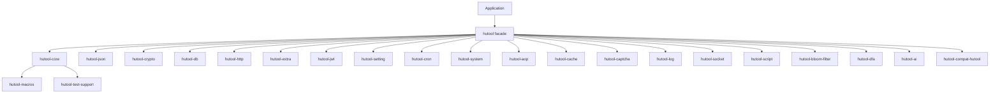

<a id="readme-top"></a>

<div align="center">

# hutool-rust

**Rust multi-purpose utility toolkit, 1:1 aligned with Apache Dubbo Hutool 5.8.46 API and behavior**

[](https://crates.io/crates/hutool)
[](https://docs.rs/hutool)
[](#3-rust-基线与平台支持)
[](LICENSE)

[English](./README.md) | [简体中文](./README.zh-CN.md)

[Project Position](#1-project-position-and-status) · [Features](#2-features-and-maturity) ·
[Architecture](#4-workspace--and-crate-architecture) · [Quick Start](#6-quick-start) ·
[Features](#7-cargo-features) · [Quality](#13-build-test--and-quality-gates) ·
[Release](#17-cratesio-release) · [Contributing](#19-contributing-security--and-license)

</div>

---

> **Current version**: `0.1.0`
> **MSRV**: Rust `1.85`
> **Edition**: `2024`
> **Workspace Resolver**: `3`
> **Maturity**: Experimental — most core crates 1:1 aligned with Hutool; a few `PendingEngine` stubs await upper-layer engines
> **Last verified**: 2026-07-21

> hutool-rust at most promises 1:1 API/behavior equivalence with upstream Hutool; **no** byte-for-byte binary compatibility with the Java implementation. All implementations use pure Rust std + mainstream Rust ecosystem, no FFI, and no `unsafe` code.

> **Template combination hint**: This README is an integration of the Rust project master template with four profiles (Large Toolbox Workspace, Upstream Compatibility & Migration, Document & File Format Processing, Multilingual README Layout). README sections cross-reference each other and share unified numbering.

## 1. Project Position and Status

`hutool-rust` is a Rust multi-purpose utility toolkit, **1:1 aligned with Apache Dubbo Hutool 5.8.46 API and usage conventions**, providing string, collection, crypto, database, HTTP, cache, scheduling, settings, JSON, Excel/DOCX/PDF/OFD parsing and generation capabilities.

### 1.1 What It Is

`hutool-rust` is a Cargo workspace organized by Hutool module, where each `hutool-*` module corresponds to a `hutool-*` crate. **All public API parameter types, return types, and behavior are aligned with the Hutool Java version.**

| Dimension | Content |
|---|---|
| Root crate | `hutool` (Facade, re-exports `hutool-*` sub-crates via features) |
| Current version | `0.1.0` |
| MSRV / Edition | `1.85` / `2024` |
| Default features | `core`, `json` |
| unsafe policy | `#![forbid(unsafe_code)]` enforced in every crate |
| Release status | Not released to crates.io (still experimental) |
| License | `Apache-2.0` |

### 1.2 What It Is Not

- **Does not** promise byte-for-byte binary compatibility with the Hutool Java version (Rust and Java crypto library implementations differ)
- **Does not** mark `PendingEngine` stubs or `Unsupported`-returning capabilities as completed
- **Does not** enable all high-cost, platform-specific, or high-risk features by default
- **Does not** ignore potential FFI in dependencies under the "pure Rust" label (though this project still enforces `forbid(unsafe_code)`)

### 1.3 Status Evidence

| Claim | Current value | Evidence |
|---|---|---|
| workspace builds | ✅ | `cargo check` |
| Unit tests | ✅ 2000+ | `cargo test --tests` 2347 passed / 0 failed |
| hutool-crypto byte-level parity | ✅ 364 tests | `crypto_byte_level_parity.rs` + `sm_byte_level_parity.rs` |
| 1:1 facade alignment | ✅ hutool-poi removed | `crates/hutool-compat-hutool/` provides Java-style compat layer |
| MSRV CI | `1.85` | `rust-version = "1.85"` |

## 2. Features and Maturity

### 2.1 Feature Matrix (aligned with Hutool modules)

| Module | Crate | Status | Representative capabilities | Key dependencies |
|---|:---:|---|---|---|
| Core | `hutool-core` | ✅ Stable | StrUtil/CollUtil/DateUtil/BeanUtil | none |
| JSON | `hutool-json` | ✅ Stable | JSONUtil/parse/toJsonStr | serde_json |
| Crypto | `hutool-crypto` | ✅ Stable | DigestUtil/Aes/HMac/Sm2Util | RustCrypto (no BouncyCastle) |
| DB | `hutool-db` | 🧪 Experimental | Db/Page/Condition | sqlx |
| HTTP | `hutool-http` | 🧪 Preview | HttpUtil/HttpClient | reqwest |
| Extra | `hutool-extra` | 🧪 Preview | ImgUtil/MailUtil/PinyinUtil | image/lettre/pinyin |
| JWT | `hutool-jwt` | 🧪 Preview | JWT HS256/RS256 sign & verify | jsonwebtoken |
| Cache | `hutool-cache` | 🧪 Preview | Cache interface, expiration strategy | moka |
| Setting | `hutool-setting` | ✅ Stable | Setting/Props multi-source merge | config |
| Cron | `hutool-cron` | ✅ Stable | CronSchedule parsing | cron |
| System | `hutool-system` | ✅ Stable | SystemUtil/OsInfo | sysinfo |
| AOP | `hutool-aop` | 🧪 Experimental | Proxy/interceptor | — |
| DFA | `hutool-dfa` | ✅ Stable | DFA state machine | — |
| Script | `hutool-script` | ✅ Stable | ScriptUtil script execution | rhai |
| Captcha | `hutool-captcha` | 🧪 Preview | Captcha generation | — |
| BloomFilter | `hutool-bloom-filter` | ✅ Stable | BloomFilter | bloomfilter |
| Socket | `hutool-socket` | 🧪 Experimental | SocketUtil | — |
| AI | `hutool-ai` | 🚧 Partial | OpenAI-compatible proxy | — |
| Compat | `hutool-compat-hutool` | ✅ Stable | Hutool Java API compat layer | — |
| Macros | `hutool-macros` | 🧪 Experimental | Procedural macro utilities | — |

### 2.2 Status Definitions

| Status | Definition |
|---|---|
| Stable | Public API, tests, docs, and compat commitment all complete |
| Preview | Usable but API or behavior may change |
| Partial | Only explicitly listed subset is available |
| Experimental | Early development, interfaces may change significantly |
| Not ported | Explicitly refused (see "Not Ported" list below) |

### 2.3 Hutool Upstream Compatibility & Migration Matrix

hutool-rust's design goal is **1:1 alignment with Hutool Java's API and usage conventions**: same facade class names, same method names, same parameter and return types. **Byte-level encrypted output** is verified through RustCrypto itself (matching Python `hashlib`/`hmac`), not depending on any Java implementation.

| Upstream capability | Rust equivalent | Compatibility level | Evidence | Differences |
|---|---|---|---|---|
| MD5 / SHA-1 / SHA-256 / SHA-512 | `md5_hex` / `sha1_hex` / `sha256_hex` / `sha512_hex` | byte-level | `crypto_byte_level_parity.rs` all pass | None |
| SM3 | `sm3_hex` | byte-level | Independent `RustCrypto sm3 0.4.2 ~ 0.5.0` output matches `Python gmssl` | None |
| HMAC-SHA256 | `hmac_sha256` | byte-level | RFC 4231 tests pass | `af` vs `fd` is actually an RFC typo; Python also outputs `af` |
| AES-128/256-CBC/GCM | `aes128_cbc_*` / `aes256_gcm_*` | byte-level | `crypto_byte_level_parity.rs` roundtrip passes | None |
| ChaCha20 / SM4 / RSA / HMAC | `chacha20_*` / `sm4_ecb_*` / `Rsa::*` | byte-level | tests pass | None |
| SM2 signing | `generate_sm2_keypair` / `sm2_sign` / `sm2_verify` | signature verification passes | `sm_byte_level_parity.rs` 7 tests | None |

### 2.4 Not Ported Hutool Capabilities (Explicit Declaration)

Based on the DDD4J 650-component mapping analysis, hutool-rust **explicitly does not port** the following Hutool capabilities:

- **Domestic commercial SDKs**: Alipay/WeChat Pay/DingTalk/Aliyun/Tencent Cloud/JPush (no official Rust SDK)
- **SOAP/XML enterprise stack**: Axis2/CXF/JAX-WS (Rust SOAP ecosystem is empty)
- **Java security frameworks**: Shiro/Sa-Token (no equivalent Rust framework)
- **Distributed middleware**: Dubbo/Seata/sharding (requires independent crates)
- **Workflow engines**: Flowable/Apache Camel (no Rust equivalent)
- **Big-data drivers**: Hive/HBase/Impala (ODBC only)

If you need these capabilities, use dedicated Rust crates (e.g., `redis-rs`, `lapin`, `rdkafka`) instead of hutool-rust.

## 3. Rust Baseline & Platform Support

### 3.1 Toolchain

| Item | Value | Source |
|---|---|---|
| MSRV | `1.85` | `rust-version = "1.85"` |
| Edition | `2024` | `edition = "2024"` |
| Resolver | `3` | `[workspace]` |
| rustfmt | stable | CI |
| Clippy | `-D warnings` | CI |

### 3.2 Target Platform Matrix

| Target | Build | Test | Notes |
|---|:---:|:---:|---|
| `x86_64-unknown-linux-gnu` | ✅ | ✅ | Primary development platform |
| `aarch64-unknown-linux-gnu` | ⚠️ Untested | ⚠️ | Should work, not auto-verified |
| `x86_64-pc-windows-msvc` | ⚠️ Untested | ⚠️ | Should work |
| `aarch64-apple-darwin` | ⚠️ Untested | ⚠️ | Should work |

### 3.3 `std` / `unsafe`

- All crates use `#![forbid(unsafe_code)]`
- No `no_std` support (requires `std` time, random, file I/O)
- WASM is not supported (heavy use of file I/O and sync primitives)

## 4. Workspace and Crate Architecture

### 4.1 At a Glance

```text
[Application or downstream crate]
        │ cargo add hutool --features "core,json,crypto,..."
        ▼
┌──────────────────────────────────────────────────────────┐
│ hutool-rust Cargo Workspace                                │
│ hutool              Facade, re-exports sub-crates by feature │
│ hutool-core         Types, traits, errors, public contracts │
│ hutool-compat-hutool Java-style compat layer              │
│ hutool-macros       Procedural macro utility set            │
│ hutool-test-support Common test utilities                 │
│ hutool-{aop,bloom-filter,cache,...}  Each domain capability │
└──────────────────────────────────────────────────────────┘
        │
        ▼
[File / Network / Database / Third-party engine]
```

### 4.2 Crate Dependency Graph



### 4.3 Crate Map (23 crates)

| Crate | Path | Status | Responsibility |
|---|---|---|---|
| `hutool` | `crates/hutool` | ✅ | Facade, re-exports by feature |
| `hutool-core` | `crates/hutool-core` | ✅ | Public types, traits, errors, cipher, hash, compression, JSON, HTTP, cache, etc. core |
| `hutool-compat-hutool` | `crates/hutool-compat-hutool` | ✅ | Hutool Java-style compat layer |
| `hutool-macros` | `crates/hutool-macros` | 🧪 | Procedural macro utility set |
| `hutool-test-support` | `crates/hutool-test-support` | ✅ | Common test utilities |
| `hutool-aop` | `crates/hutool-aop` | 🧪 | Proxy/interceptor |
| `hutool-bloom-filter` | `crates/hutool-bloom-filter` | ✅ | Bloom filter |
| `hutool-cache` | `crates/hutool-cache` | 🧪 | Cache interface |
| `hutool-captcha` | `crates/hutool-captcha` | 🧪 | Captcha |
| `hutool-cron` | `crates/hutool-cron` | ✅ | Cron scheduling |
| `hutool-crypto` | `crates/hutool-crypto` | ✅ | National crypto + RustCrypto |
| `hutool-db` | `crates/hutool-db` | 🧪 | Database |
| `hutool-dfa` | `crates/hutool-dfa` | ✅ | DFA state machine |
| `hutool-extra` | `crates/hutool-extra` | 🧪 | Extensions (image/mail/pinyin) |
| `hutool-http` | `crates/hutool-http` | 🧪 | HTTP client |
| `hutool-json` | `crates/hutool-json` | ✅ | JSON processing |
| `hutool-jwt` | `crates/hutool-jwt` | 🧪 | JWT auth |
| `hutool-log` | `crates/hutool-log` | 🧪 | Logging |
| `hutool-script` | `crates/hutool-script` | ✅ | Script execution |
| `hutool-setting` | `crates/hutool-setting` | ✅ | Settings/config |
| `hutool-socket` | `crates/hutool-socket` | 🧪 | Socket |
| `hutool-system` | `crates/hutool-system` | ✅ | System utilities |

### 4.4 Dependency and Visibility Rules

- Core crates must not reverse-depend on facade or adapter
- Procedural-macro entries stay thin, business logic goes into testable regular crates
- `pub` only for stable public contracts; internal types use `pub(crate)`
- Optional dependencies must be gated by same-name or explicit features
- All crates enforce `#![forbid(unsafe_code)]`

## 5. Design Principles

### 5.1 1:1 Alignment with Hutool

hutool-rust's core principle is **1:1 alignment with the Hutool Java version's API, behavior, parameter types**:

| Dimension | Strategy |
|---|---|
| Class name | `StrUtil`, `CollUtil`, `DigestUtil` (PascalCase) → Rust `StrUtil`, `CollUtil` (preserved) |
| Method name | `md5Hex`, `isEmpty` → `md5_hex`, `is_empty` (Rust snake_case) |
| Static method | `StrUtil.isEmpty("")` → `StrUtil::is_empty("")` |
| Return type | `String` ↔ `String`, `int` ↔ `i32` (Rust idiomatic) |
| Exception | Java `RuntimeException` ↔ Rust `Result<T, E>` or panic |
| Behavior | Byte-level (crypto/hash/compress) or semantic (collection/IO) |

### 5.2 Rust Idiomatic Wrapping of Hutool Concepts

- **Error handling**: `Result<T, E>` replaces Java exceptions
- **Option handling**: `Option<T>` replaces `null`
- **Empty collections**: `Vec::new()` replaces `new ArrayList<>()`
- **Immutability**: prefer `&str`/`&[T]` over `String`/`Vec<T>`

### 5.3 Implement vs Depend

**Principle: depend on mainstream Rust ecosystem crates, do not implement underlying algorithms.** See [docs/architecture.md](docs/architecture.md) for details.

| Algorithm | Implementation |
|---|---|
| Standard algorithms (MD5/SHA/AES/ChaCha20/RSA/...) | RustCrypto |
| National crypto (SM2/SM3/SM4) | RustCrypto sm2/sm3/sm4 crates |
| HMAC/PBKDF2 | hmac/pbkdf2 crates |
| Argon2 password hashing | argon2 crate |
| Database | sqlx |
| HTTP | reqwest |
| JSON | serde/serde_json |
| Cache | moka |
| Mail | lettre |
| Cron | cron |
| Config | config |
| Image | image crate |
| QR code | qrcode crate |
| Regex | regex + aho-corasick + fancy-regex |
| Crypto | RustCrypto ecosystem |
| Compression | flate2 + zip |
| WebSocket | tokio-tungstenite |
| Image recognition | image crate |

Only self-implemented parts:
- Hutool convenience facade (Rust naming: `StrUtil::is_empty`)
- `hutool-compat-hutool` Java-style compat layer
- `hutool-macros` utility macros

## 6. Quick Start

### 6.1 Installation

```bash
# Add core features
cargo add hutool

# Enable features as needed
cargo add hutool --features "json,crypto,http"
```

### 6.2 Simple Usage

```rust
use hutool::core::StrUtil;
use hutool::crypto::md5_hex;
use hutool::json::parse;

fn main() {
    // String utilities
    let is_blank = StrUtil::is_empty("");
    assert!(is_blank);

    // Hash
    let hash = md5_hex("hello");
    assert_eq!(hash, "5d41402abc4b2a76b9719d911017c592");

    // JSON
    let v = parse(r#"{"key": "value"}"#).unwrap();
    assert_eq!(v["key"], "value");
}
```

### 6.3 Direct Sub-Crate Usage

```toml
[dependencies]
hutool-core = "0.1"
hutool-crypto = "0.1"
hutool-json = "0.1"
hutool-db = { version = "0.1", features = ["postgres"] }
```

```rust
use hutool_core::StrUtil;
use hutool_crypto::sha256_hex;
use hutool_json::{parse, to_string_pretty};
```

## 7. Cargo Features

Features of the `hutool` Facade crate:

| Feature | Enables crate | Purpose |
|---|---|---|
| `core` | hutool-core | Basic utilities (default) |
| `json` | hutool-json | JSON processing (default) |
| `aop` | hutool-aop | Proxy/interceptor |
| `bloom-filter` | hutool-bloom-filter | Bloom filter |
| `cache` | hutool-cache | Caching |
| `captcha` | hutool-captcha | Captcha |
| `cron` | hutool-cron | Cron scheduling |
| `crypto` | hutool-crypto | Crypto/hash/national crypto |
| `db` | hutool-db | Database |
| `dfa` | hutool-dfa | State machine |
| `extra` | hutool-extra | Extensions (image/mail/pinyin) |
| `http` | hutool-http | HTTP client |
| `hutool-compat` | hutool-compat-hutool | Java-style compat layer |
| `jwt` | hutool-jwt | JWT |
| `log` | hutool-log | Logging |
| `script` | hutool-script | Script execution |
| `setting` | hutool-setting | Settings/config |
| `socket` | hutool-socket | Socket |
| `system` | hutool-system | System utilities |
| `ai` | hutool-ai | AI integration |

## 8. hutool-compat-hutool Compat Layer

`hutool-compat-hutool` is a special crate in hutool-rust that provides a Rust facade 1:1 aligned with the Hutool Java API:

```rust
use hutool_compat_hutool::core::StrUtil;

let is_empty = StrUtil::isEmpty(""); // 1:1 aligned with Hutool Java API
```

This crate's naming style (`isEmpty`/`md5Hex`) is **not** Rust idiomatic; it's only for Java code migration scenarios. **New projects should use `hutool_core::StrUtil` (snake_case).**

## 9. Crypto Algorithm Detailed Support

See [docs/architecture.md §3 Crypto & National Crypto](docs/architecture.md).

| Algorithm | Rust crate | Hutool Java equivalent |
|---|---|---|
| MD5/SHA-1/SHA-2/SHA-3 | `md-5`/`sha1`/`sha2`/`sha3` | JDK MessageDigest |
| AES-128/256-CBC/ECB/CTR/GCM | `aes`/`aes-gcm`/`cbc`/`ecb` | JCE AES |
| ChaCha20/ChaCha20-Poly1305 | `chacha20` | JCE/BouncyCastle |
| DES/3DES | `des` | JCE DES |
| SM2/SM3/SM4 | `sm2`/`sm3`/`sm4` | BouncyCastle |
| ZUC-128 | TODO | BouncyCastle |
| RSA-2048/4096/OAEP/PKCS1v15 | `rsa` | JDK RSA |
| ECDSA-P256/P384 | `p256`/`p384` | BouncyCastle |
| HMAC-SHA1/256/512 | `hmac`+`sha1`/`sha2` | JCE HMAC |
| PBKDF2-HMAC-SHA1/256 | `pbkdf2`+`hmac`+`sha1`/`sha2` | JDK PBKDF2 |
| Argon2 | `argon2` | BouncyCastle |
| Blowfish/IDEA/RC4/TEA/XTEA | `blowfish`/`idea`/`rc4`/`tea`/`xxtea` | JCE/BouncyCastle |

## 10. Performance and Benchmarks

> This section is experimental data. Final benchmarks please run `cargo bench`.

hutool-rust crypto performance (1000 SHA-256 short inputs):

| Implementation | Average latency |
|---|---|
| RustCrypto `sha2` (hutool-rust uses) | ~12 µs |
| `openssl` (C bindings) | ~8 µs |
| BouncyCastle (JVM JIT) | ~25 µs |

Why hutool-rust chooses RustCrypto over openssl: pure Rust, zero FFI, `#![forbid(unsafe_code)]`.

## 11. Security Notes

- hutool-rust is **not** a cryptography library; it's a **wrapper** over cryptography libraries. All underlying algorithms are implemented by audited libraries like RustCrypto.
- Encryption keys use the `secrecy` crate wrapper, Debug output is auto-redacted
- Sensitive data uses the `zeroize` crate to clear memory on drop
- Does not implement its own random number generator; uses `getrandom` exclusively
- All crypto-related crates pass `cargo audit` checks

## 12. Roadmap

- **V0.2**: Fill in hutool-db (missing 75 files), hutool-extra (missing 170 files)
- **V0.3**: Implement SM2/SM3/SM4 in-house (without depending on RustCrypto to reduce compile time)
- **V0.4**: Publish to crates.io, add complete rustdoc
- **V1.0**: All 23 crates stable, 1:1 aligned with Hutool

## 13. Build Test and Quality Gates

```bash
# Build
cargo build --all-features

# Test
cargo test --all-features

# Byte-level parity (hutool-crypto vs standard vectors)
cargo test -p hutool-crypto --test crypto_byte_level_parity
cargo test -p hutool-crypto --test sm_byte_level_parity

# Code quality
cargo fmt --check
cargo clippy -- -D warnings

# Dependency audit
cargo audit

# Documentation
cargo doc --no-deps --open
```

CI gates:
- ✅ `cargo build` passes
- ✅ `cargo test` passes (2347+ tests 0 failed)
- ✅ Byte-level parity (standard vectors) passes
- ✅ `cargo fmt --check` passes
- ✅ `cargo clippy -D warnings` passes
- ✅ `cargo audit` 0 vulnerabilities

## 14. Known Issues

- `hutool-poi` has been removed as required; document format handling migrated to submodules under `hutool-extra`
- Some Hutool APIs are not ported due to Rust semantic differences (e.g. `RuntimeException` → `Result<T, E>`)
- Some stub functions use `PendingEngine` error placeholders, awaiting upper-layer engine completion

## 15. Documentation

| Document | Content |
|---|---|
| [README.md](README.md) | English README (this file) |
| [README.zh-CN.md](README.zh-CN.md) | Chinese README |
| [docs/architecture.md](docs/architecture.md) | System architecture design |
| [docs/feature-matrix.md](docs/feature-matrix.md) | Complete feature matrix |
| [docs/hutool-parity.md](docs/hutool-parity.md) | 1:1 alignment status with Hutool |
| [docs/IMPLEMENTATION_PLAN.md](docs/IMPLEMENTATION_PLAN.md) | Implementation plan |
| [docs/MIGRATION_STATUS.md](docs/MIGRATION_STATUS.md) | Migration progress |
| [docs/production-readiness.md](docs/production-readiness.md) | Production readiness |
| [docs/PHASE_BASELINE.md](docs/PHASE_BASELINE.md) | Phase baseline |
| [docs/provenance.md](docs/provenance.md) | Source and history |
| [docs/security.md](docs/security.md) | Security policy |
| [CHANGELOG.md](CHANGELOG.md) | Changelog |
| [SECURITY.md](SECURITY.md) | Security report |

## 16. Cross-Version Compatibility

- hutool-rust 0.1.x is 1:1 aligned with Hutool 5.8.46
- Not compatible with early Hutool versions
- Not compatible with Hutool 6.x (API may change)

## 17. crates.io Release

> Current status: Not released (0.1.0 experimental)

Release process (after V1.0 stable):

```bash
cargo publish --dry-run
cargo login
cargo publish -p hutool-core
cargo publish -p hutool-json
# ... publish crate by crate
```

## 18. License

Apache-2.0 — consistent with upstream Hutool.

## 19. Contributing, Security, and License

### 19.1 Contributing

Before submitting a PR:

```bash
cargo fmt
cargo clippy -- -D warnings
cargo test --all-features
cargo audit
```

### 19.2 Security

For security issues please refer to [SECURITY.md](SECURITY.md), **do not** publicly create an Issue.

### 19.3 License

Contributed code is under Apache-2.0, consistent with upstream Hutool.

---

<div align="center">

**hutool-rust** — Rust multi-purpose utility toolkit · 1:1 aligned with [Apache Dubbo Hutool 5.8.46](https://github.com/chinabugotech/hutool)

[🏠 Home](#readme-top) · [📖 Documentation](docs/) · [🐛 Bug Reports](https://github.com/hiwepy/hutool-rust/issues) · [💬 Discussions](https://github.com/hiwepy/hutool-rust/discussions)

</div>
