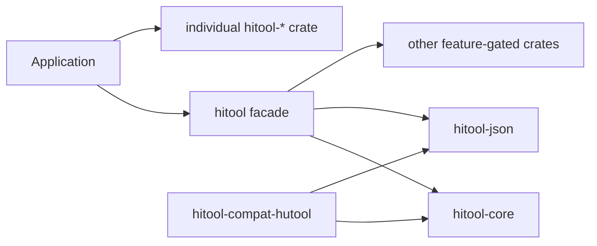

# HiTool

HiTool is a production-oriented Rust utility workspace. Its public crate names
follow Hutool's capability model, while its APIs and implementations follow Rust
conventions and build on mature Rust crates.



## Current status

- All 20 Hutool capability modules have matching `hitool-*` crates.
- Every public capability crate contains an initial tested implementation; no
  public crate is a placeholder.
- Default features remain intentionally small: `core` and `json` only.
- Database drivers, blocking HTTP, legacy crypto, and Hutool compatibility are
  explicit opt-ins.
- This is a `0.1` development line. Crate-level capability presence does not
  imply method-for-method Hutool parity; see the parity ledger below.

## Quick start

```toml
[dependencies]
hitool = "0.1"
```

```rust
use hitool::prelude::*;

assert!("  \t".is_blank());
assert_eq!(" hello ".trimmed(), "hello");
```

Build a production HTTP client with explicit limits:

```rust
use std::time::Duration;
use hitool::http::{DenyLocalTargets, HttpClient};

let client = HttpClient::builder()
    .connect_timeout(Duration::from_secs(3))
    .timeout(Duration::from_secs(10))
    .max_response_size(8 * 1024 * 1024)
    .redirect_limit(5)
    .url_policy(DenyLocalTargets)
    .build()?;
# Ok::<(), hitool::http::HttpError>(())
```

Enable only the capabilities an application needs:

```toml
[dependencies]
hitool = { version = "0.1", default-features = false, features = ["core", "json"] }
```

Runnable examples live under `crates/hitool/examples`; start with
`cargo run -p hitool --example core_json`.

## Capability map

| Area | Crate | Current engine or implementation |
|---|---|---|
| Core utilities | `hitool-core` | Standard library, `chrono`, `uuid` |
| JSON | `hitool-json` | `serde`, `serde_json` |
| HTTP | `hitool-http` | `reqwest`, Rustls, bounded responses |
| Database | `hitool-db` | SQLx pools behind driver features |
| Crypto/JWT | `hitool-crypto`, `hitool-jwt` | RustCrypto, Argon2id, `jsonwebtoken` |
| Cache/search | `hitool-cache`, `hitool-dfa`, `hitool-bloom-filter` | Moka, Aho-Corasick, `bloomfilter` |
| Config/observability | `hitool-setting`, `hitool-log`, `hitool-system` | `config`, `tracing`, `sysinfo` |
| Scheduling/network | `hitool-cron`, `hitool-socket` | `cron`, Tokio |
| Documents/extra | `hitool-poi`, `hitool-extra`, `hitool-captcha` | bounded XLSX/CSV/DOCX, QR/ZIP/image/mail, SVG/PNG/audio CAPTCHA |
| Extension | `hitool-aop`, `hitool-script`, `hitool-ai` | Interceptor chain, Rhai, provider abstraction |

Detailed governance is documented in
[`docs/feature-matrix.md`](docs/feature-matrix.md),
[`docs/hutool-parity.md`](docs/hutool-parity.md), and
[`docs/security.md`](docs/security.md). The requirement-by-requirement release
ledger is [`docs/production-readiness.md`](docs/production-readiness.md).

## License and provenance

HiTool is licensed under Apache-2.0. See `NOTICE` and
`docs/provenance.md` for source attribution and clean-room rules.
