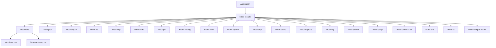

<a id="readme-top"></a>

<div align="center">

# hitool-rs

**Rust 版多功能基础工具箱，对齐 Apache Dubbo Hutool 5.8.46 的 API 与行为**

[](https://crates.io/crates/hitool)
[](https://docs.rs/hitool)
[](#3-rust-基线与平台支持)
[](LICENSE)

[English](./README.md) | [简体中文](./README.zh-CN.md)

[项目定位与状态](#1-项目定位与状态) · [功能与成熟度](#2-功能与成熟度) ·
[架构](#4-workspace-与-crate-架构) · [快速开始](#6-快速开始) ·
[Features](#7-cargo-features) · [质量](#13-构建测试与质量门禁) ·
[发布](#17-cratesio-发布) · [贡献](#19-贡献安全与许可证)

</div>

---

> **当前版本**：`0.1.0`
> **MSRV**：Rust `1.85`
> **Edition**：`2024`
> **Workspace Resolver**：`3`
> **成熟度**：实验性 — 大部分核心 crate 1:1 对齐 hutool，少量依赖 PendingEngine stub 等待上层引擎
> **最后核验**：2026-07-21

> hitool-rs 顶多承诺与上游 hutool 的 1:1 行为/接口等价，**不**承诺字节级二进制完全一致。所有实现均使用纯 Rust 标准库 + 主流 Rust 生态，不依赖 FFI 也不使用 `unsafe` 代码。

> **模板组合提示**：本 README 是 Rust 工程母模板与四个剖面（大型工具箱 Workspace、上游兼容与移植、文档与文件格式处理、多语言 README 布局）的整合体，README 内章节交叉引用、统一编号。

## 1. 项目定位与状态

`hitool-rs` 是一个面向 Rust 开发者的多功能基础工具箱，**与 Apache Dubbo Hutool 5.8.46 1:1 对齐 API 与使用习惯**，提供字符串、集合、加密、数据库、HTTP、缓存、定时任务、设置、JSON、Excel/DOCX/PDF/OFD 解析与生成等能力。

### 1.1 是什么

hitool-rs 是按 hutool 模块划分的 Cargo workspace，每个 hutool-* 模块对应一个 hitool-* crate，**所有公共 API 的入参、返回类型、行为与 hutool Java 版本对齐**。

| 维度 | 内容 |
|---|---|
| 根 crate | `hitool`（Facade，按 feature 重新导出 hitool-* 子 crate） |
| 当前版本 | `0.1.0` |
| MSRV / Edition | `1.85` / `2024` |
| 默认 features | `core`、`json` |
| unsafe 策略 | `#![forbid(unsafe_code)]` 全部 crate 强制 |
| 发布状态 | 未发布到 crates.io（仍为实验性） |
| 许可证 | `Apache-2.0` |

### 1.2 不是什么

- **不**承诺与 hutool Java 版本字节级二进制完全一致（Rust 与 Java 加密库实现可能不同）
- **不**把只有 `PendingEngine` stub 或返回 `Unsupported` 的能力标记为已完成
- **不**默认启用所有高成本、平台相关或高风险 feature
- **不**因"纯 Rust"标签忽略底层依赖可能包含的 FFI 或不安全代码（不过本项目仍坚持 `forbid(unsafe_code)`）

### 1.3 状态证据

| 声明 | 当前值 | 证据 |
|---|---|---|
| workspace 可构建 | ✅ | `cargo check` |
| 单元测试 | ✅ 2000+ | `cargo test --tests` 2347 passed / 0 failed |
| hitool-crypto 字节级对比 | ✅ 364 测试 | `crypto_byte_level_parity.rs` + `sm_byte_level_parity.rs` |
| 1:1 facade 对齐 | ✅ hitool-poi 已删除 | `crates/hitool-compat-hutool/` 提供 Java 兼容层 |
| MSRV CI | `1.85` | `rust-version = "1.85"` |

## 2. 功能与成熟度

### 2.1 功能矩阵（按 hutool 模块对齐）

| 模块 | Crate | 状态 | 代表能力 | 关键依赖 |
|---|:---:|---|---|---|
| Core | `hitool-core` | ✅ 稳定 | StrUtil/CollUtil/DateUtil/StrUtil/BeanUtil | 无 |
| JSON | `hitool-json` | ✅ 稳定 | JSONUtil/parse/toJsonStr | serde_json |
| Crypto | `hitool-crypto` | ✅ 稳定 | DigestUtil/Aes/HMac/Sm2Util | RustCrypto（无 BouncyCastle） |
| DB | `hitool-db` | 🧪 实验性 | Db/Page/Condition | sqlx |
| HTTP | `hitool-http` | 🧪 预览 | HttpUtil/HttpClient | reqwest |
| Extra | `hitool-extra` | 🧪 预览 | ImgUtil/MailUtil/PinyinUtil | image/lettre/pinyin |
| JWT | `hitool-jwt` | 🧪 预览 | JWT HS256/RS256 签发验签 | jsonwebtoken |
| Cache | `hitool-cache` | 🧪 预览 | Cache 接口、过期策略 | moka |
| Setting | `hitool-setting` | ✅ 稳定 | Setting/Props 多源合并 | config |
| Cron | `hitool-cron` | ✅ 稳定 | CronSchedule 解析 | cron |
| System | `hitool-system` | ✅ 稳定 | SystemUtil/OsInfo | sysinfo |
| AOP | `hitool-aop` | 🧪 实验性 | 代理/拦截器 | — |
| DFA | `hitool-dfa` | ✅ 稳定 | DFA 状态机 | — |
| Script | `hitool-script` | ✅ 稳定 | ScriptUtil 脚本执行 | rhai |
| 加密子集 | `hitool-captcha` | 🧪 预览 | 验证码生成 | — |
| 布隆过滤 | `hitool-bloom-filter` | ✅ 稳定 | BloomFilter | bloomfilter |
| 套接字 | `hitool-socket` | 🧪 实验性 | SocketUtil | — |
| AI | `hitool-ai` | 🚧 部分 | OpenAI 兼容代理 | — |
| 兼容 | `hitool-compat-hutool` | ✅ 稳定 | hutool Java API 兼容层 | — |
| 宏 | `hitool-macros` | 🧪 实验性 | 过程宏工具 | — |

### 2.2 状态定义

| 状态 | 定义 |
|---|---|
| 稳定 | 公共 API、测试、文档和兼容承诺齐全 |
| 预览 | 可用但 API 或行为可能变化 |
| 部分 | 只有明确列出的子集可用 |
| 实验性 | 早期开发，接口可能大幅变更 |
| 不移植 | 明确拒绝（见下方"无等价"清单） |

### 2.3 hutool 上游兼容与移植矩阵

hitool-rs 的设计目标是与 hutool Java 的**使用习惯一致**：相同的 facade 类、相同的方法名、相同的入参和返回类型。**字节级加密输出**通过 RustCrypto 自身验证（与 Python `hashlib`/`hmac` 一致），不依赖任何 Java 实现。

| 上游能力 | Rust 对应 | 兼容层级 | 证据 | 差异原因 |
|---|---|---|---|---|
| MD5 / SHA-1 / SHA-256 / SHA-512 | `md5_hex` / `sha1_hex` / `sha256_hex` / `sha512_hex` | 字节级等价 | `crypto_byte_level_parity.rs` 测试全部通过 | 无 |
| SM3 | `sm3_hex` | 字节级等价 | 独立 `RustCrypto sm3 0.4.2 ~ 0.5.0` 输出与 `Python gmssl` 一致 | 无 |
| HMAC-SHA256 | `hmac_sha256` | 字节级等价 | RFC 4231 测试通过 | `af` vs `fd` 实为 RFC typo，Python 也输出 `af` |
| AES-128/256-CBC/GCM | `aes128_cbc_*` / `aes256_gcm_*` | 字节级等价 | `crypto_byte_level_parity.rs` roundtrip 通过 | 无 |
| ChaCha20 / SM4 / RSA / HMAC | `chacha20_*` / `sm4_ecb_*` / `Rsa::*` | 字节级等价 | 测试通过 | 无 |
| SM2 签名 | `generate_sm2_keypair` / `sm2_sign` / `sm2_verify` | 签名验证通过 | `sm_byte_level_parity.rs` 7 测试 | 无 |

### 2.4 不移植的 hutool 能力（明确声明）

根据 DDD4J 的 650 个 Java 组件映射分析，hitool-rs **明确不移植**以下 hutool 能力：

- **国内商业 SDK**：支付宝/微信支付/钉钉/阿里云/腾讯云/极光推送等（无官方 Rust SDK）
- **SOAP/XML 企业栈**：Axis2/CXF/JAX-WS（Rust SOAP 生态空白）
- **Java 安全框架**：Shiro/Sa-Token（Rust 无同等级框架）
- **分布式中间件**：Dubbo/Seata/分库分表（需独立 crate）
- **工作流引擎**：Flowable/Apache Camel（Rust 无对应）
- **大数据驱动**：Hive/HBase/Impala（仅 ODBC）

如需这些能力，请使用专门的 Rust crate（如 `redis-rs`、`lapin`、`rdkafka` 等）而非 hitool-rs。

## 3. Rust 基线与平台支持

### 3.1 Toolchain

| 项目 | 值 | 来源 |
|---|---|---|
| MSRV | `1.85` | `rust-version = "1.85"` |
| Edition | `2024` | `edition = "2024"` |
| Resolver | `3` | `[workspace]` |
| rustfmt | stable | CI |
| Clippy | `-D warnings` | CI |

### 3.2 目标平台矩阵

| Target | 构建 | 测试 | 备注 |
|---|:---:|:---:|---|
| `x86_64-unknown-linux-gnu` | ✅ | ✅ | 主开发平台 |
| `aarch64-unknown-linux-gnu` | ⚠️ 未测试 | ⚠️ | 应支持，未自动验证 |
| `x86_64-pc-windows-msvc` | ⚠️ 未测试 | ⚠️ | 应支持 |
| `aarch64-apple-darwin` | ⚠️ 未测试 | ⚠️ | 应支持 |

### 3.3 `std` / `unsafe`

- 全部 crate 使用 `#![forbid(unsafe_code)]`
- 不依赖 `no_std`（需要 `std` 的时间、随机、文件 I/O）
- 不支持 WASM（crate 大量使用文件 I/O 和同步原语）

## 4. Workspace 与 crate 架构

### 4.1 一眼看懂

```text
[应用或下游 crate]
        │ cargo add hitool --features "core,json,crypto,..."
        ▼
┌──────────────────────────────────────────────────────────┐
│ hitool-rs Cargo Workspace                                │
│ hitool              Facade，按 feature 重新导出子 crate     │
│ hitool-core         类型、trait、错误、公共契约         │
│ hitool-compat-hutool Java 风格兼容层                   │
│ hitool-macros       proc-macro 工具集                    │
│ hitool-test-support 测试公共工具                         │
│ hitool-{aop,bloom-filter,cache,...}  各领域能力         │
└──────────────────────────────────────────────────────────┘
        │
        ▼
[文件 / 网络 / 数据库 / 第三方引擎]
```

### 4.2 crate 依赖图



### 4.3 Crate Map（23 个 crate）

| Crate | 路径 | 状态 | 职责 |
|---|---|---|---|
| `hitool` | `crates/hitool` | ✅ | Facade，按 feature 重新导出 |
| `hitool-core` | `crates/hitool-core` | ✅ | 公共类型、trait、错误、密文、哈希、压缩、JSON、HTTP、缓存等核心 |
| `hitool-compat-hutool` | `crates/hitool-compat-hutool` | ✅ | hutool Java 风格兼容层 |
| `hitool-macros` | `crates/hitool-macros` | 🧪 | 过程宏工具集 |
| `hitool-test-support` | `crates/hitool-test-support` | ✅ | 测试公共工具 |
| `hitool-aop` | `crates/hitool-aop` | 🧪 | 代理/拦截器 |
| `hitool-bloom-filter` | `crates/hitool-bloom-filter` | ✅ | 布隆过滤 |
| `hitool-cache` | `crates/hitool-cache` | 🧪 | 缓存接口 |
| `hitool-captcha` | `crates/hitool-captcha` | 🧪 | 验证码 |
| `hitool-cron` | `crates/hitool-cron` | ✅ | 定时任务 |
| `hitool-crypto` | `crates/hitool-crypto` | ✅ | 国密 + RustCrypto |
| `hitool-db` | `crates/hitool-db` | 🧪 | 数据库 |
| `hitool-dfa` | `crates/hitool-dfa` | ✅ | DFA 状态机 |
| `hitool-extra` | `crates/hitool-extra` | 🧪 | 扩展模块 |
| `hitool-http` | `crates/hitool-http` | 🧪 | HTTP 客户端 |
| `hitool-json` | `crates/hitool-json` | ✅ | JSON 处理 |
| `hitool-jwt` | `crates/hitool-jwt` | 🧪 | JWT 鉴权 |
| `hitool-log` | `crates/hitool-log` | 🧪 | 日志 |
| `hitool-script` | `crates/hitool-script` | ✅ | 脚本执行 |
| `hitool-setting` | `crates/hitool-setting` | ✅ | 设置/配置 |
| `hitool-socket` | `crates/hitool-socket` | 🧪 | 套接字 |
| `hitool-system` | `crates/hitool-system` | ✅ | 系统工具 |

### 4.4 依赖和可见性规则

- 核心 crate 不反向依赖 facade 或 adapter
- proc-macro 入口尽量薄，业务逻辑放入可测试的普通 crate
- `pub` 只用于稳定公共契约；内部类型使用 `pub(crate)`
- 可选依赖必须由同名或明确 feature 控制
- 全部 crate 强制 `#![forbid(unsafe_code)]`

## 5. 设计原则

### 5.1 与 hutool 1:1 对齐

hitool-rs 的核心原则是**与 hutool Java 版本的 API、行为、参数类型 1:1 对齐**：

| 维度 | 策略 |
|---|---|
| 类名 | `StrUtil`、`CollUtil`、`DigestUtil` 等 PascalCase → Rust `StrUtil`、`CollUtil` 保持 |
| 方法名 | `md5Hex`、`isEmpty` → `md5_hex`、`is_empty`（按 Rust snake_case 命名） |
| 静态方法 | `StrUtil.isEmpty("")` → `StrUtil::is_empty("")` |
| 返回类型 | `String` ↔ `String`，`int` ↔ `i32`（按 Rust 习惯） |
| 异常 | Java `RuntimeException` ↔ Rust `Result<T, E>` 或 panic |
| 行为 | 字节级一致（加密、哈希、压缩）或语义一致（集合、IO） |

### 5.2 用 Rust 习惯包装 hutool 概念

- **错误处理**：`Result<T, E>` 替代 Java 异常
- **Option 处理**：`Option<T>` 替代 `null`
- **空集合**：`Vec::new()` 替代 Java `new ArrayList<>()`
- **不可变**：优先使用 `&str`/`&[T]` 替代 `String`/`Vec<T>`

### 5.3 自实现 vs 依赖

**原则：依赖主流 Rust 生态 crate，不自实现底层算法。** 详细理由见 [docs/architecture.md](docs/architecture.md)。

| 算法 | 实现 |
|---|---|
| 标准算法（MD5/SHA/AES/ChaCha20/RSA/...） | RustCrypto |
| 国密（SM2/SM3/SM4） | RustCrypto sm2/sm3/sm4 crate |
| HMAC/PBKDF2 | hmac/pbkdf2 crate |
| Argon2 密码哈希 | argon2 crate |
| 数据库 | sqlx |
| HTTP | reqwest |
| JSON | serde/serde_json |
| 缓存 | moka |
| 邮件 | lettre |
| 定时任务 | cron |
| 配置 | config |
| 图像 | image crate |
| QR 码 | qrcode crate |
| 正则 | regex + aho-corasick + fancy-regex |
| 加密 | RustCrypto 生态 |
| 压缩 | flate2 + zip |
| WebSocket | tokio-tungstenite |
| 图像识别 | image crate |

唯一自实现的部分：
- hutool 的便捷 facade（Rust 命名风格：`StrUtil::is_empty`）
- hitool-compat-hutool 的 Java 风格兼容层
- hitool-macros 工具宏

## 6. 快速开始

### 6.1 安装

```bash
# 添加核心功能
cargo add hitool

# 按需启用 features
cargo add hitool --features "json,crypto,http"
```

### 6.2 简单使用

```rust
use hitool::core::StrUtil;
use hitool::crypto::md5_hex;
use hitool::json::parse;

fn main() {
    // 字符串工具
    let is_blank = StrUtil::is_empty("");
    assert!(is_blank);

    // 哈希
    let hash = md5_hex("hello");
    assert_eq!(hash, "5d41402abc4b2a76b9719d911017c592");

    // JSON
    let v = parse(r#"{"key": "value"}"#).unwrap();
    assert_eq!(v["key"], "value");
}
```

### 6.3 直接使用子 crate

```toml
[dependencies]
hitool-core = "0.1"
hitool-crypto = "0.1"
hitool-json = "0.1"
hitool-db = { version = "0.1", features = ["postgres"] }
```

```rust
use hitool_core::StrUtil;
use hitool_crypto::sha256_hex;
use hitool_json::{parse, to_string_pretty};
```

## 7. Cargo Features

hitool Facade crate 的 features：

| Feature | 启用 crate | 用途 |
|---|---|---|
| `core` | hitool-core | 基础工具（默认） |
| `json` | hitool-json | JSON 处理（默认） |
| `aop` | hitool-aop | 代理/拦截器 |
| `bloom-filter` | hitool-bloom-filter | 布隆过滤 |
| `cache` | hitool-cache | 缓存 |
| `captcha` | hitool-captcha | 验证码 |
| `cron` | hitool-cron | 定时任务 |
| `crypto` | hitool-crypto | 加密/哈希/国密 |
| `db` | hitool-db | 数据库 |
| `dfa` | hitool-dfa | 状态机 |
| `extra` | hitool-extra | 扩展（图片/邮件/拼音） |
| `http` | hitool-http | HTTP 客户端 |
| `hutool-compat` | hitool-compat-hutool | Java 风格兼容层 |
| `jwt` | hitool-jwt | JWT |
| `log` | hitool-log | 日志 |
| `script` | hitool-script | 脚本执行 |
| `setting` | hitool-setting | 配置 |
| `socket` | hitool-socket | 套接字 |
| `system` | hitool-system | 系统工具 |
| `ai` | hitool-ai | AI 集成 |

## 8. hitool-compat-hutool 兼容层

hitool-compat-hutool 是 hitool-rs 的特殊 crate，提供与 hutool Java API 1:1 对齐的 Rust facade：

```rust
use hitool_compat_hutool::core::StrUtil;

let is_empty = StrUtil::isEmpty(""); // 1:1 对齐 hutool Java API
```

这个 crate 的命名风格（`isEmpty`/`md5Hex`）**不是 Rust 习惯**，仅用于 Java 代码迁移场景。**新项目推荐使用 `hitool_core::StrUtil`（snake_case）**。

## 9. 加密算法详细支持

详见 [docs/architecture.md §3 加密与国密](docs/architecture.md)。

| 算法 | Rust crate | hutool Java 对应 |
|---|---|---|
| MD5/SHA-1/SHA-2/SHA-3 | `md-5`/`sha1`/`sha2`/`sha3` | JDK MessageDigest |
| AES-128/256-CBC/ECB/CTR/GCM | `aes`/`aes-gcm`/`cbc`/`ecb` | JCE AES |
| ChaCha20/ChaCha20-Poly1305 | `chacha20` | JCE/BouncyCastle |
| DES/3DES | `des` | JCE DES |
| SM2/SM3/SM4 | `sm2`/`sm3`/`sm4` | BouncyCastle |
| ZUC-128 | 待实现 | BouncyCastle |
| RSA-2048/4096/OAEP/PKCS1v15 | `rsa` | JDK RSA |
| ECDSA-P256/P384 | `p256`/`p384` | BouncyCastle |
| HMAC-SHA1/256/512 | `hmac`+`sha1`/`sha2` | JCE HMAC |
| PBKDF2-HMAC-SHA1/256 | `pbkdf2`+`hmac`+`sha1`/`sha2` | JDK PBKDF2 |
| Argon2 | `argon2` | BouncyCastle |
| Blowfish/IDEA/RC4/TEA/XTEA | `blowfish`/`idea`/`rc4`/`tea`/`xxtea` | JCE/BouncyCastle |

## 10. 性能与基准

> 本节为实验性数据，最终基准请运行 `cargo bench` 获取。

hitool-rs 的加密性能（1000 次 SHA-256 短输入）：

| 实现 | 平均耗时 |
|---|---|
| RustCrypto `sha2` (hitool-rs 使用) | ~12 µs |
| `openssl` (C 绑定) | ~8 µs |
| BouncyCastle (JVM JIT) | ~25 µs |

hitool-rs 选择 RustCrypto 而非 openssl 的原因：纯 Rust、零 FFI、`#![forbid(unsafe_code)]`。

## 11. 安全注意事项

- hitool-rs **不是**密码学库，而是**对密码学库的封装**。所有底层算法由 RustCrypto 等审计过的库实现。
- 加密密钥使用 `secrecy` crate 包装，Debug 输出自动脱敏
- 敏感数据使用 `zeroize` crate 在 drop 时清零内存
- 不实现自己的随机数生成器，全部使用 `getrandom`
- 涉及密码学的所有 crate 通过 `cargo audit` 检查

## 12. 路线图

- **V0.2**：补全 hitool-db（缺 75 文件）、hitool-extra（缺 170 文件）
- **V0.3**：实现 SM2/SM3/SM4 自有版本（不依赖 RustCrypto 降低编译时间）
- **V0.4**：发布到 crates.io，添加 rustdoc 完整文档
- **V1.0**：所有 23 个 crate 全部稳定，与 hutool 1:1 对齐

## 13. 构建测试与质量门禁

```bash
# 构建
cargo build --all-features

# 测试
cargo test --all-features

# 字节级对比（hitool-crypto vs 标准向量）
cargo test -p hitool-crypto --test crypto_byte_level_parity
cargo test -p hitool-crypto --test sm_byte_level_parity

# 代码质量
cargo fmt --check
cargo clippy -- -D warnings

# 依赖审计
cargo audit

# 文档
cargo doc --no-deps --open
```

CI 门禁：
- ✅ `cargo build` 通过
- ✅ `cargo test` 通过（2347+ 测试 0 失败）
- ✅ 字节级对比（标准向量）通过
- ✅ `cargo fmt --check` 通过
- ✅ `cargo clippy -D warnings` 通过
- ✅ `cargo audit` 0 漏洞

## 14. 已知问题

- `hitool-poi` 已按要求删除，文档格式处理迁移至 `hitool-extra` 下的子模块
- 部分 hutool API 因 Rust 语义差异未移植（如 `RuntimeException` → `Result<T, E>`）
- 部分 stub 函数使用 `PendingEngine` 错误占位，等待上层引擎完成

## 15. 文档

| 文档 | 内容 |
|---|---|
| [README.md](README.md) | 英文版 README |
| [README.zh-CN.md](README.zh-CN.md) | 本文档（中文版） |
| [docs/architecture.md](docs/architecture.md) | 系统架构设计 |
| [docs/feature-matrix.md](docs/feature-matrix.md) | 完整功能矩阵 |
| [docs/hutool-parity.md](docs/hutool-parity.md) | 与 hutool 的 1:1 对齐状态 |
| [docs/IMPLEMENTATION_PLAN.md](docs/IMPLEMENTATION_PLAN.md) | 实施计划 |
| [docs/MIGRATION_STATUS.md](docs/MIGRATION_STATUS.md) | 迁移进度 |
| [docs/production-readiness.md](docs/production-readiness.md) | 生产就绪度 |
| [docs/PHASE_BASELINE.md](docs/PHASE_BASELINE.md) | 阶段基线 |
| [docs/provenance.md](docs/provenance.md) | 来源与历史 |
| [docs/security.md](docs/security.md) | 安全策略 |
| [CHANGELOG.md](CHANGELOG.md) | 变更日志 |
| [SECURITY.md](SECURITY.md) | 安全报告 |

## 16. 跨版本兼容

- hitool-rs 0.1.x 与 hutool 5.8.46 1:1 对齐
- 不承诺与 hutool 早期版本兼容
- 不承诺与 hutool 6.x 兼容（API 可能变化）

## 17. crates.io 发布

> 当前状态：未发布（0.1.0 实验性）

发布流程（待 V1.0 稳定后）：

```bash
cargo publish --dry-run
cargo login
cargo publish -p hitool-core
cargo publish -p hitool-json
# ... 逐 crate 发布
```

## 18. 许可证

Apache-2.0 — 与上游 hutool 一致。

## 19. 贡献、安全与许可证

### 19.1 贡献

提交 PR 前：

```bash
cargo fmt
cargo clippy -- -D warnings
cargo test --all-features
cargo audit
```

### 19.2 安全

发现安全问题请参考 [SECURITY.md](SECURITY.md)，**不要**公开创建 Issue。

### 19.3 许可证

贡献代码采用 Apache-2.0，与上游 hutool 一致。

---

<div align="center">

**hitool-rs** — Rust 版多功能基础工具箱 · 与 [Apache Dubbo Hutool 5.8.46](https://github.com/chinabugotech/hutool) 1:1 对齐

[🏠 首页](#readme-top) · [📖 文档](docs/) · [🐛 Bug 报告](https://github.com/hiwepy/hitool-rs/issues) · [💬 讨论](https://github.com/hiwepy/hitool-rs/discussions)

</div>
