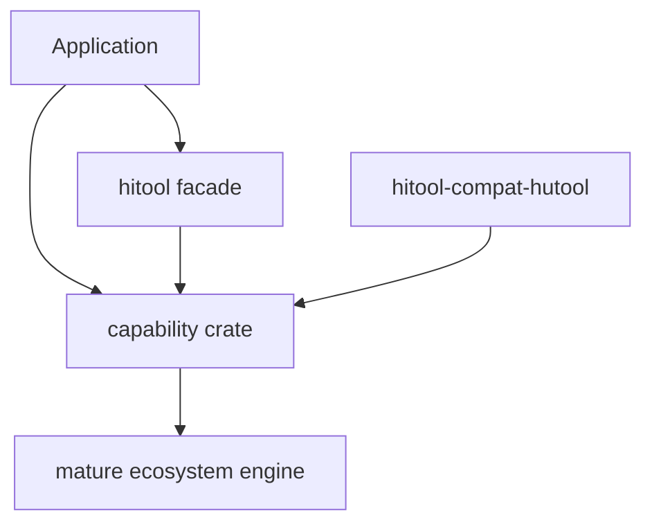
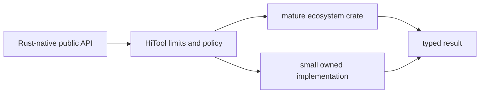

# Architecture

The root `hitool` crate aggregates additive Cargo features and re-exports
capability crates. Capability crates never depend on the root facade. Compatibility
APIs are isolated in `hitool-compat-hutool`.

Wrappers exist to make cross-cutting behavior explicit: typed errors, input and
response ceilings, cancellation, secret redaction, and feature boundaries. A
capability is implemented directly only when the ecosystem has no suitable
maintained primitive or when the logic is deliberately small (for example, SSE
framing and compatibility naming).

## Dependency rules

- `hitool` may depend on capability crates; capability crates never depend on
  the facade.
- Capability crates may depend on `hitool-core`, but core has no runtime,
  network, database, logging, or facade dependency.
- `hitool-compat-hutool` delegates to native crates and owns no competing
  implementation.
- Optional database drivers, blocking I/O, compatibility APIs, and future
  legacy algorithms remain separate Cargo features.

`hitool` replaces Hutool's `hutool-all` role. Cargo workspace dependency
inheritance and lockstep publishing replace the Maven-only `hutool-bom` role.
