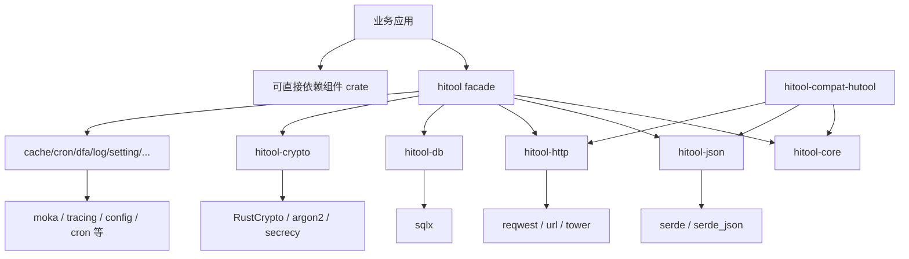

# HiTool：生产级 Rust 工具平台架构方案

我会把它定义为：**Hutool 能力模型 + Rust 惯用 API + 成熟 crate 引擎 + 可选 Hutool 兼容层**。

项目命名统一确定为：

- 项目品牌：**HiTool**。
- 根 crate：`hitool`。
- Rust 仓库：`hitool-rs`。
- 公开组件 crate：统一使用 `hitool-*` 前缀，并与 Hutool 模块名称对齐。

不会直接 Fork `yimi-rutool` 扩写。它适合作为能力清单和原型参考，但当前 `0.2.5` 仍采用单 crate、`full` 默认开启，并公开存在 RSA 时序侧信道风险；生产版需要重新划分安全、依赖和生命周期边界。[[yimi-rutool 上游说明](https://docs.rs/crate/yimi-rutool/latest)](https://docs.rs/crate/yimi-rutool/latest)、[[RustSec RUSTSEC-2023-0071](https://rustsec.org/advisories/RUSTSEC-2023-0071.html)](https://rustsec.org/advisories/RUSTSEC-2023-0071.html)

## 1. 总体架构



依赖规则：

- `hitool` 只做 Feature 聚合、模块重导出和 `prelude`。
- 功能组件绝不反向依赖 `hitool`。
- 组件之间只允许单向依赖，不允许环。
- 业务既可以使用 `hitool` 全局门面，也可以只依赖 `hitool-http`。
- 上游 crate 的类型尽量直接暴露，避免包一层毫无价值的 DTO。
- Hutool 风格 API 放在独立兼容层，不污染 Rust 惯用 API。

## 2. Workspace 划分

```text
hitool-rs/
├── Cargo.toml
├── crates/
│   ├── hitool/                    # 公共聚合门面
│   ├── hitool-aop/                # Trait、装饰器与中间件式切面能力
│   ├── hitool-bloom-filter/       # Bloom Filter
│   ├── hitool-cache/              # 本地缓存抽象与 Moka 实现
│   ├── hitool-core/               # 字符串、集合、转换、ID、IO 小工具
│   ├── hitool-cron/               # Tokio 定时调度与 Cron 表达式
│   ├── hitool-crypto/             # 高层安全密码 API
│   ├── hitool-db/                 # SQLx、事务、分页、迁移辅助
│   ├── hitool-dfa/                # DFA、Aho-Corasick 与敏感词匹配
│   ├── hitool-extra/              # 邮件、二维码、图片、压缩等扩展能力
│   ├── hitool-http/               # HTTP 客户端、安全策略、中间件
│   ├── hitool-log/                # tracing 初始化、Span 与脱敏
│   ├── hitool-script/             # 可控脚本执行与沙箱扩展点
│   ├── hitool-setting/            # 文件、环境变量、默认值分层配置
│   ├── hitool-system/             # 操作系统、进程与运行环境信息
│   ├── hitool-json/               # JSON、Serde 与字段策略
│   ├── hitool-poi/                # Excel、Word 等 Office 文档能力
│   ├── hitool-captcha/            # 验证码生成与校验
│   ├── hitool-socket/             # TCP、UDP 与异步 Socket 辅助
│   ├── hitool-jwt/                # JWT 创建与验证
│   ├── hitool-ai/                 # AI Provider、模型请求与流式响应抽象
│   ├── hitool-macros/             # 可选派生宏
│   ├── hitool-compat-hutool/      # StrUtil/JsonUtil 等迁移 API
│   └── hitool-test-support/       # 测试服务器、Fixture、断言
├── examples/
├── benches/
├── fuzz/
├── docs/
│   ├── architecture.md
│   ├── feature-matrix.md
│   ├── security.md
│   └── hutool-parity.md
└── deny.toml
```

公开 crate 与 Hutool 模块的命名关系：

| Hutool | HiTool | 处理方式 |
|---|---|---|
| `hutool-all` | `hitool` | 根 crate 直接承担聚合门面职责，不再发布 `hitool-all` |
| `hutool-bom` | 无独立 crate | 使用 `[workspace.dependencies]`、`Cargo.lock` 和锁步版本治理 |
| `hutool-bloomFilter` | `hitool-bloom-filter` | 保持语义一致，按 Cargo 小写 kebab-case 规范化 |
| 其他 `hutool-*` | 对应 `hitool-*` | 模块名称一一对齐，内部实现采用 Rust 惯用 API 与成熟 crate |

`serde`、`tracing`、`config`、`moka` 等名称只表示内部执行引擎，不再形成与 Hutool 能力模型平行的公开 crate。`hitool-poi` 保留 Hutool 的迁移认知，但不会依赖 Java Apache POI；其实现使用 Rust 的 Office 文档生态。

建议的成熟引擎：

| 组件 | 上游引擎 |
|---|---|
| 序列化 | [`[serde](https://docs.rs/serde/latest/serde/)`](https://docs.rs/serde/latest/serde/)、`serde_json`、`serde_with` |
| HTTP | [`[reqwest](https://docs.rs/reqwest/latest/reqwest/)`](https://docs.rs/reqwest/latest/reqwest/)、`url`，中间件按需使用 `tower` |
| 数据库 | [`[sqlx](https://docs.rs/sqlx/latest/sqlx/)`](https://docs.rs/sqlx/latest/sqlx/) |
| 配置 | [`[config](https://docs.rs/config/latest/config/)`](https://docs.rs/config/latest/config/) |
| 日志追踪 | [`[tracing](https://docs.rs/tracing/latest/tracing/)`](https://docs.rs/tracing/latest/tracing/) |
| 缓存 | [`[moka](https://docs.rs/moka/latest/moka/)`](https://docs.rs/moka/latest/moka/) |
| JWT | `jsonwebtoken` |
| 密码 | RustCrypto、`argon2`、`secrecy`、`zeroize` |
| 文本搜索 | `aho-corasick`、`regex`、`unicode-normalization` |
| 调度 | `tokio-cron-scheduler` |
| 错误定义 | `thiserror` |

## 3. Feature 设计

Cargo 官方明确要求 Feature 尽量保持“可叠加”，并提醒默认 Feature 一旦发布，后续移除可能成为破坏性变更。因此不能复制 `yimi-rutool` 的“默认 full”策略。[[Cargo Features 指南](https://doc.rust-lang.org/cargo/reference/features.html)](https://doc.rust-lang.org/cargo/reference/features.html)

根 Workspace：

```toml
[workspace]
resolver = "3"
members = ["crates/*"]

[workspace.package]
edition = "2024"
rust-version = "1.85"
license = "MIT OR Apache-2.0"
repository = "https://github.com/hiwepy/hitool-rs"

[workspace.lints.rust]
unsafe_code = "deny"
missing_docs = "warn"

[workspace.lints.clippy]
all = "warn"
pedantic = "warn"
```

Edition 2024 默认使用 Resolver 3，并能够根据 `rust-version` 更合理地解析依赖。[[Cargo Resolver](https://doc.rust-lang.org/cargo/reference/resolver.html)](https://doc.rust-lang.org/cargo/reference/resolver.html)

门面 crate：

```toml
[features]
default = ["core", "json"]

core = ["dep:hitool-core"]
aop = ["core", "dep:hitool-aop"]
bloom-filter = ["core", "dep:hitool-bloom-filter"]
cache = ["core", "dep:hitool-cache"]
cron = ["log", "dep:hitool-cron"]
crypto = ["dep:hitool-crypto"]
crypto-legacy = ["crypto", "hitool-crypto/legacy"]
db = ["json", "dep:hitool-db"]
db-postgres = ["db", "hitool-db/postgres"]
db-mysql = ["db", "hitool-db/mysql"]
db-sqlite = ["db", "hitool-db/sqlite"]
dfa = ["core", "dep:hitool-dfa"]
extra = ["core", "dep:hitool-extra"]
http = ["json", "dep:hitool-http"]
http-blocking = ["http", "hitool-http/blocking"]
log = ["dep:hitool-log"]
script = ["core", "dep:hitool-script"]
setting = ["json", "dep:hitool-setting"]
system = ["core", "dep:hitool-system"]
json = ["core", "dep:hitool-json"]
poi = ["core", "dep:hitool-poi"]
captcha = ["core", "dep:hitool-captcha"]
socket = ["log", "dep:hitool-socket"]
jwt = ["json", "crypto", "dep:hitool-jwt"]
ai = ["http", "json", "dep:hitool-ai"]
hutool-compat = ["core", "json", "dep:hitool-compat-hutool"]

# 不作为 default；数据库驱动仍需显式选择。
full = [
    "core",
    "aop",
    "bloom-filter",
    "cache",
    "cron",
    "crypto",
    "db",
    "dfa",
    "extra",
    "http",
    "log",
    "script",
    "setting",
    "system",
    "json",
    "poi",
    "captcha",
    "socket",
    "jwt",
    "ai",
]
```

规则：

- `full` 存在，但绝不默认启用。
- `core` 不依赖 Tokio、SQLx、Reqwest。
- 公开 Feature 与公开 crate 同名，降低从 Hutool 迁移时的认知成本。
- 数据库驱动必须显式选择。
- `native-tls` 与 `rustls` 不用互斥 Feature 改变 API；默认采用 Rustls，其他后端通过配置或独立适配 crate 提供。
- Feature 只能增加能力，不能改变已有函数语义。
- 每个 Feature 都需要记录编译成本、MSRV、平台限制和安全影响。

## 4. API 设计：两套表面，一套实现

### Rust 惯用 API

```rust
use hitool::prelude::*;

assert!("   ".is_blank());
assert_eq!(" hello ".trimmed(), "hello");

let json = hitool::json::to_string(&value)?;

let client = hitool::http::HttpClient::builder()
    .timeout(Duration::from_secs(10))
    .max_response_size(8 * 1024 * 1024)
    .redirect_limit(5)
    .build()?;

let response = client
    .get("https://example.com")
    .send()
    .await?;
```

设计原则：

- 无状态能力使用自由函数或 Extension Trait。
- 有状态能力使用 `Client`、`Builder`、`Pool`、`Scheduler`。
- 转换使用 `From`、`TryFrom`、`AsRef`，不创造万能 `ConvertUtil`。
- 资源通过 RAII 管理。
- 不在库内部偷偷创建 Tokio Runtime。
- 不使用隐藏的全局 HTTP Client、数据库连接池或配置单例。
- 类型尽可能实现 `Debug`、`Clone`、`Display`、`Send`、`Sync` 等常见 Trait。[[Rust API Guidelines](https://rust-lang.github.io/api-guidelines/interoperability.html)](https://rust-lang.github.io/api-guidelines/interoperability.html)

### Hutool 兼容 API

```rust
#[cfg(feature = "hutool-compat")]
use hitool::compat::{JsonUtil, StrUtil};

assert!(StrUtil::is_blank("   "));
let json = JsonUtil::to_string(&value)?;
```

兼容层主要帮助 Java/Hutool 用户迁移，不承诺逐方法、逐行为复制。每个 API 在 `hutool-parity.md` 中标记：

- `native`：Rust 标准库已经覆盖。
- `idiomatic`：由 Rust 惯用 API 替代。
- `compatible`：提供 Hutool 风格兼容入口。
- `unsafe-to-copy`：因安全或语义问题拒绝复制。
- `planned`：尚未实现。

例如 Bean 拷贝不能复制 Java 反射模型，应使用 `serde`、`TryFrom` 或派生宏生成静态映射。

## 5. 错误与运行时边界

不要像原型工具包那样用一个顶层 `Error` 包含所有模块。

```rust
pub enum HttpError { /* ... */ }
pub enum CryptoError { /* ... */ }
pub enum ConfigError { /* ... */ }
pub enum DatabaseError { /* ... */ }
```

要求：

- 公共错误实现 `Error + Send + Sync + 'static`。
- 保留上游错误为 `source()`。
- `thiserror` 用于库错误。
- `anyhow` 只允许出现在示例、CLI 和集成测试。
- 不随意把所有错误转换成字符串。
- `panic!` 仅用于内部不变量；用户输入错误必须返回 `Result`。
- 超时、取消、重试耗尽必须是可识别错误类型。

## 6. HTTP、DB 和调度的生产约束

HTTP 默认必须具备：

- 连接超时、总超时和响应体上限。
- 重定向次数限制。
- 默认不记录 Authorization、Cookie 和请求正文。
- SSRF 地址策略扩展点。
- 重试仅对明确幂等请求启用。
- 流式下载，不强制将响应全部读入内存。
- Client 可注入，便于连接复用和测试。

数据库必须：

- 直接围绕 SQLx Pool 和 Transaction 构建。
- 不隐藏事务边界。
- 不包装成自研 ORM。
- 不提供隐式全局连接池。
- 查询辅助只解决分页、命名参数、审计上下文等稳定问题。

调度器必须：

- 接受外部 Tokio Handle，不自建 Runtime。
- 支持优雅停机、任务超时、取消、并发限制。
- 重试策略与任务本身解耦。
- 每次执行自动产生 tracing Span。

## 7. 密码与安全设计

安全模块是与 `yimi-rutool` 差异最大的地方。

- MD5、SHA-1、ECB 等只进入 `crypto-legacy`，并明确禁止用于密码和认证。
- 密码哈希只提供 Argon2 等专用接口。
- 密钥使用 `SecretString`/`SecretVec`，日志输出自动脱敏。
- 敏感内存尽可能使用 `zeroize`。
- 网络可观察环境中的 RSA 私钥运算，在对应 RustSec 问题修复前不进入默认能力。
- JWT 必须显式指定允许的算法、Issuer、Audience、时钟偏差和过期策略。
- 解压模块必须防止路径穿越、压缩炸弹和无限展开。
- 所有网络/解析入口都支持大小、深度或时间限制。

CI 使用 `cargo-deny` 检查许可证、重复依赖、来源和安全公告。[[cargo-deny 检查能力](https://embarkstudios.github.io/cargo-deny/checks/index.html)](https://embarkstudios.github.io/cargo-deny/checks/index.html)

## 8. 质量门禁

生产级不能只用“单元测试全部通过”定义。

每个 PR 至少执行：

```text
cargo fmt --check
cargo clippy --workspace --all-targets --all-features -- -D warnings
cargo test --workspace
cargo test --workspace --no-default-features
cargo test --workspace --all-features
cargo doc --workspace --all-features --no-deps
cargo deny check
cargo semver-checks
```

测试体系：

- 单元测试：纯函数和边界条件。
- Property Test：转换、编码、日期、集合不变量。
- Fuzz：JSON、JWT、压缩包、URL、Cron、文本解析器。
- 集成测试：真实 HTTP 服务和 PostgreSQL/MySQL/SQLite。
- Compile-fail：错误用法必须无法编译。
- 并发测试：缓存、调度、连接池取消安全。
- Benchmark：只为热点路径建立稳定基线。
- Feature Matrix：默认、无默认、单 Feature、常见组合、全 Feature。
- 平台矩阵：Linux GNU/MUSL、macOS、Windows。
- MSRV、Stable 和 Nightly 分别验证。

## 9. 发布和治理

我建议 `hitool` 及所有 `hitool-*` crate 初期采用锁步版本发布，降低兼容成本：

```text
0.1  core、json、setting、http、log
0.2  crypto、jwt、cache、dfa、bloom-filter、extra
0.3  db、cron、aop、script、system、poi、captcha、socket、ai、hutool-compat
0.9  API 冻结、安全审计、模糊测试、性能基线
1.0  SemVer 稳定承诺
```

达到 1.0 的条件：

- 无未豁免的高危/严重 RustSec 公告。
- 所有公开 API 有文档、错误、取消和安全说明。
- Feature Matrix 全绿。
- MSRV 明确并持续验证。
- 关键解析器完成 Fuzz。
- 公共 API 通过 SemVer 检查。
- unsafe 默认为零；确有必要时必须隔离、说明不变量并单独审计。
- 有迁移指南、CHANGELOG、SECURITY.md 和支持周期。

## 10. 两个前置风险

第一，命名已经确定为项目品牌 **HiTool**、根 crate `hitool`、Rust 仓库 `hitool-rs`。截至 2026-07-16，crates.io 未发现已发布的 `hitool`，但 crate 名遵循先到先得；在公开开发前应优先占位 `hitool` 以及首批核心组件名。[[Cargo 发布规则](https://doc.rust-lang.org/cargo/reference/publishing.html)](https://doc.rust-lang.org/cargo/reference/publishing.html)

第二，Hutool 当前使用木兰宽松许可证，`yimi-rutool` 声明 MIT/Apache。要建立源码来源台账和 API clean-room 规则；如果直接翻译或复制代码，不能仅凭重新实现就假定可以换许可证，正式发布前应经过许可证合规审查。

最终我会把 `yimi-rutool` 当成“功能原型”，把 Hutool 当成“能力目录”，把成熟 crate 当成“执行引擎”；HiTool 自己只拥有稳定的用户体验、安全默认值、跨 crate 策略和兼容门面。这样才有机会成为真正可维护的生产级 Rust 工具平台，而不是又一个庞大的工具类集合。

整体设计置信度：高。项目品牌、根 crate 和 Rust 仓库命名已经确定；实施前还需完成 crates.io 首批名称占位，并确定首个 1.0 版本承诺覆盖的 Hutool 能力范围。
