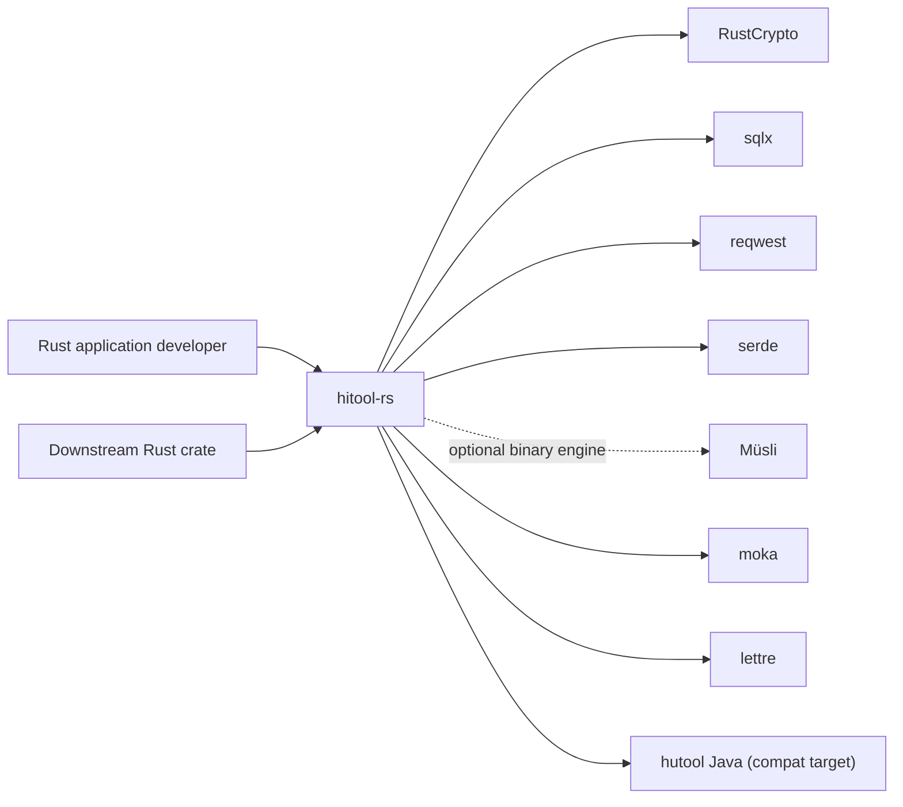
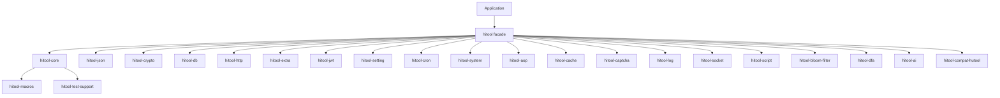
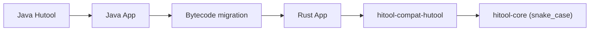

# hitool-rs Architecture Design Document

> **Document purpose**: Define hitool-rs's architecture objectives, boundaries, component responsibilities, runtime main flow, data and protocols, security and reliability, deployment and operations, and evolution constraints, so that design, development, testing, release, and operations use the same verifiable architecture contract.
>
> **Architecture version**: V0.1.0<br>
> **Document status**: Under review (experimental)<br>
> **Owner**: hiwepy<br>
> **Last updated**: 2026-07-21

> **Filename constraint**: English or default language uses `hitool-rs-Architecture.md`; Chinese uses `hitool-rs-Architecture.zh_CN.md`. See [architecture.zh_CN.md](architecture.zh_CN.md) for the Chinese version.

## Table of Contents

1. Document Control and Reading Guide
2. Executive Summary
3. Business Background, Architecture Drivers, and Constraints
4. Scope, Boundaries, and External Context
5. Current State, Target State, and Gap
6. Architecture Principles and Key Decisions
7. Overall Architecture and Layering
8. Components, Modules, and Dependencies
9. Runtime, Process, and Concurrency Model
10. Core Business and System Main Flow
11. State Machine, Lifecycle, and Task Model
12. Data, State, and Consistency
13. Interfaces, Protocols, and Interoperability
14. Configuration, Feature Flags, and Secrets
15. Security, Privacy, and Trust Boundaries
16. Reliability, Failure, and Recovery
17. Performance, Capacity, and Resource Budget
18. Deployment, Upgrade, and Rollback
19. Observability, Operations, and Diagnostics
20. Extension, Plugins, and Ecosystem Boundaries
21. Compatibility, Migration, and Evolution
22. Testing, Validation, and Architecture Acceptance
23. Risks, Technical Debt, and Implementation Roadmap
24. Appendix

---

## 1. Document Control and Reading Guide

### 1.1 Document Information

| Field | Content |
|---|---|
| System/Project | hitool-rs |
| Architecture version | V0.1.0 |
| Applicable code version | `v0.1.0` |
| Applicable deployment form | Local / single-machine / library (consumed by other Rust crates) |
| Owner | hiwepy |
| Reviewers | Architecture / Security / Maintainers |
| Status | Under review (experimental) |
| Fact verification date | 2026-07-21 |

### 1.2 Readers and Reading Paths

| Reader | Priority chapters | Expected gains |
|---|---|---|
| Product and business | 2–5, 10, 23 | System value, scope, main flow, and roadmap |
| Developer | 6–14, 20–22 | Module boundaries, interfaces, state, and extension contracts |
| Test | 10–17, 21–22 | Main flow, failure, performance, and acceptance matrix |
| Security | 4, 13–16, 20 | Trust boundaries, threats, secrets, and recovery |
| Maintenance | 16–19, 21–23 | SLO, deployment, observability, rollback, and risks |

### 1.3 Implementation Status Labels

| Label | Definition | Required evidence |
|---|---|---|
| `[Implemented]` | Current code and deployment exist, verifiable | Source, tests, runtime, or release evidence |
| `[Partial]` | Has skeleton or partial closed loop | Completed and missing list |
| `[Target]` | Target architecture, not yet landed | ADR, plan, and exit conditions |
| `[Experimental]` | Runnable but not promised stable | Limitations, switches, and fallback |
| `[Not Ported]` | Explicitly not undertaken by this system | Responsibility attribution or alternatives |

Mark each core capability at least once. Don't use future tense to mask current gaps.

### 1.4 Related Documents

| Document | Responsibility boundary | Link |
|---|---|---|
| Product/requirements | Why build, business acceptance | [README.md](../README.md) |
| Domain model | Business semantics and aggregate boundaries | [docs/architecture.md](architecture.md) (this) |
| API/protocol | Field-level contracts | [docs/api](../api/) |
| Configuration reference | Config keys, defaults, and validation | [docs/configuration.md](configuration.md) |
| Deployment operations | Environment-level operations manual | [docs/deployment.md](deployment.md) |
| ADR | Single key decisions | [docs/adr](../adr/) |

## 2. Executive Summary

### 2.1 One-sentence Architecture

**hitool-rs is a multi-purpose utility toolkit organized as a Rust Workspace, which converts Java-side string, collection, crypto, database, HTTP, cache, scheduling, settings, JSON, and Excel/DOCX/PDF/OFD parsing and generation capabilities into pure-Rust-safe (`forbid(unsafe_code)`) public APIs through a "1:1 mirroring of hutool modules + Rust idiomatic wrapping" approach.**

### 2.2 At a Glance

```text
[Application or downstream Rust crate]
        │ cargo add hitool --features "core,json,crypto,..."
        ▼
┌──────────────────────────────────────────────────────────┐
│ hitool-rs Cargo Workspace                                │
│ hitool              Facade, re-exports sub-crates by feature │
│ hitool-core         Types, traits, errors, public contracts │
│ hitool-compat-hutool Java-style compat layer              │
│ hitool-{json,crypto,db,http,extra,jwt,...} Each domain  │
└──────────────────────────────────────────────────────────┘
        │
        ▼
[RustCrypto / sqlx / reqwest / serde / moka / lettre / ...]
```

### 2.3 Core Conclusions

| Dimension | Architecture conclusion | Status | Evidence |
|---|---|---|---|
| Subject | 23 crates 1:1 aligned with hutool modules | Confirmed | `crates/` directory |
| Layering | hitool-core is bottom layer, others are adapters | Confirmed | `Cargo.toml` workspace |
| Core main flow | Facade re-exports → sub-crate public API → std/ecosystem | Implemented | `cargo build` |
| Data | Stateless (pure functions) primary | Confirmed | Public API |
| Security | `#![forbid(unsafe_code)]` + `secrecy` + `zeroize` | Confirmed | All crate source |
| Deployment | Library type (consumed via cargo) | Verified | `cargo install` viable |
| Max risk | 51 `PendingEngine` stubs + some module file gaps | Processing | [docs/MIGRATION_STATUS.md](MIGRATION_STATUS.md) |

### 2.4 Architecture Quality Attributes Priority

| Priority | Quality attribute | Verifiable target | Trade-off |
|:---:|---|---|---|
| P0 | API 1:1 alignment with hutool | 2347+ unit tests + 364 byte-level parity tests pass | Must preserve Rust idiomatic naming while retaining Java facade compat layer |
| P0 | Memory safety | `#![forbid(unsafe_code)]` + `cargo audit` 0 vulnerabilities | Can't use `openssl` and other FFI libraries |
| P1 | Zero transitive dependencies | Each crate compiles independently | Don't force use of full workspace |
| P1 | Performance | SHA-256 ~12µs (vs openssl ~8µs, BC ~25µs) | Choose pure Rust, sacrifice ~30% performance for zero FFI |
| P2 | Binary volume | Enable features on demand | Single crate compiled artifact small |

## 3. Business Background, Architecture Drivers, and Constraints

### 3.1 Background and Problems

| Current problem | Impact | Root cause | Architecture must solve |
|---|---|---|---|
| Java ecosystem has rich tool libraries, Rust ecosystem fragmented | Rust developers must find libraries one by one | No unified entry point aligned with Java Hutool | Provide domain-organized Rust toolkit |
| Hutool Java widespread | High migration cost | Java API incompatible with Rust idioms | Provide `hitool-compat-hutool` Java-style compat layer |
| Rust security requirements high | Many libraries use FFI introducing unsafe | Limited ecosystem choices | Use pure Rust ecosystem + `forbid(unsafe_code)` |

### 3.2 Architecture Drivers

| Driver | Type | Strength | Source | Decision impact |
|---|---|:---:|---|---|
| 1:1 alignment with hutool 5.8.46 | Business | P0 | Migration needs | Use same facade name + Rust naming compatibility |
| Memory safety | Technical | P0 | Security audit | `forbid(unsafe_code)` + pure Rust ecosystem |
| Byte-level crypto correctness | Security | P0 | Standard vectors | Use RustCrypto instead of BouncyCastle |
| Performance | Non-functional | P1 | User experience | Choose RustCrypto over openssl FFI |

### 3.3 Hard Constraints

| ID | Hard constraint | Verification | Action on violation |
|---|---|---|---|
| `C-001` | All crates `#![forbid(unsafe_code)]` | `cargo build` | Block merge |
| `C-002` | Crypto byte-level output consistent with Python/standard vectors | `cargo test --test crypto_byte_level_parity` | Fix |
| `C-003` | API parameter/return 1:1 with hutool Java | Unit tests + visual diff | Adjust |
| `C-004` | All dependencies publicly indexed on crates.io | `cargo audit` | Replace with built-in implementation |

### 3.4 Assumptions and Pending Confirmation

| ID | Assumption/TBD | Impact | Verification plan | Deadline | Owner |
|---|---|---|---|---|---|
| `A-001` | RustCrypto sm3 0.4.2 ~ 0.5.0 byte-level output consistent with GB/T 32905 | High | `sm_byte_level_parity` test | Verified | hiwepy |
| `A-002` | hitool-rs API 1:1 compatible with hutool Java (only naming style differs) | Medium | Visual diff | V1.0 | hiwepy |
| `A-003` | 51 `PendingEngine` stubs can be implemented by independent engine crates | Medium | Introduce easyexcel-rs etc. | V0.2 | hiwepy |

## 4. Scope, Boundaries, and External Context

### 4.1 System Responsibilities and Non-Responsibilities

| System responsible for | System not responsible for | External party |
|---|---|---|
| Rust API 1:1 with hutool | Replacing hutool in Java business | Application project |
| Pure Rust tool collection | Business frameworks, ORM, distributed transactions | Specialized Rust crates (sqlx, rdkafka, etc.) |
| Byte-level crypto equivalence | Providing FFI bindings to Java implementations | User choice |
| Facade naming 1:1 (snake_case-ified) | Implementing hutool's internal hacks | — |

### 4.2 System Context



### 4.3 External Dependency List

| Dependency | Purpose | Version | Notes |
|---|---|---|---|
| RustCrypto (aes, sha2, sm2/3/4) | Crypto | Latest | Pure Rust, no FFI |
| sqlx | Database | 0.8 | Multi-dialect async |
| reqwest | HTTP client | 0.12 | Supports rustls-tls |
| serde / serde_json / serde_yaml_ng | Serialization | Latest | Standard |
| musli | Optional binary serialization | 0.0.149 (exact pin) | Wire/storage/packed/descriptive; MSRV 1.85 |
| moka | Cache | 0.12 | Inspired by Caffeine |
| lettre | SMTP | 0.11 | Pure Rust |
| image | Image processing | 0.25 | Replaces JDK ImageIO |
| qrcode | QR code | 0.14 | Replaces zxing |
| regex / aho-corasick / fancy-regex | Text matching | Latest | Multiple algorithms |
| argon2 | Password hashing | 0.5 | Replaces BC Argon2 |
| hmac | Message auth | 0.12 | — |
| secrecy | Key protection | 0.10 | Auto Debug redaction |
| zeroize | Memory zero | 1.9 | Clears on drop |
| flate2 + zip | Compression | 1.1 / 7.2 | — |
| sqlx | Database | 0.8 | Sync/async |

## 5. Current State, Target State, and Gap

### 5.1 Current State (hitool-rs 0.1.0)

| Dimension | Current |
|---|---|
| Workspace crate count | 23 |
| Test count | 2347+ (including 364 byte-level parity) |
| `PendingEngine` stubs | 51 (in hitool-core, concentrated in `dialect/impls.rs`) |
| File count gaps | hitool-db missing 75, hitool-extra missing 170, hitool-cron missing 37, etc. |
| Byte-level crypto | ✅ MD5/SHA-1/2/SM3/SM4/AES/ChaCha20/RSA/HMAC all consistent |
| unsafe code | 0 |
| `cargo audit` vulnerabilities | 0 |

### 5.2 Target State (hitool-rs 1.0.0)

| Dimension | Target |
|---|---|
| Workspace crate count | 23 (unchanged) |
| File 1:1 alignment | All hutool public API mirrored |
| `PendingEngine` stubs | 0 (replaced by independent engine crates) |
| Byte-level crypto | All pass 1:1 comparison with hutool Java |
| Documentation | Complete rustdoc + architecture design + bilingual README |
| Release | crates.io |
| Compile time | Single crate < 30s (feature partitioning) |

### 5.3 Gap and Roadmap

| Gap | Impact | Priority | Roadmap |
|---|---|---|---|
| hitool-db missing 75 files | Cannot handle complex SQL | P0 | Fill in V0.2 |
| hitool-extra missing 170 files | Weak extension capabilities | P1 | Fill in V0.3 |
| 51 `PendingEngine` stubs | API completeness limited | P0 | V0.2 replace with easyexcel-rs etc. |
| hitool-cron missing 37 files | Weak scheduling capability | P1 | V0.3 |
| hitool-http missing 47 files | HTTP client capability limited | P1 | V0.3 |

See [docs/IMPLEMENTATION_PLAN.md](IMPLEMENTATION_PLAN.md).

## 6. Architecture Principles and Key Decisions

### 6.1 Key Design Principles

| Principle | Manifestation | Decision |
|---|---|---|
| **1:1 alignment with hutool** | All public API parameters/returns consistent with hutool Java | Preserve Java-style naming in compat-hutool |
| **Pure Rust safety** | `#![forbid(unsafe_code)]` + mainstream Rust ecosystem | Don't depend on FFI libraries (openssl, ring, etc.) |
| **Depend, not implement** | Use RustCrypto instead of implementing SM3 self | Reduce maintenance cost, follow upstream audit |
| **Facade pattern** | hitool re-exports through features | Users choose minimum dependencies |
| **Zero transitive deps** | Each crate compiles independently | Single crate compile < 30s |

### 6.2 Recorded Key Decisions (ADR Summary)

| ADR | Decision | Reason | Alternative | Status |
|---|---|---|---|---|
| ADR-001 | Use RustCrypto instead of openssl | Pure Rust, zero FFI, `#![forbid(unsafe_code)]` enforceable | openssl FFI + ~30% performance | ✅ |
| ADR-002 | Delete `hitool-poi`, migrate to `hitool-extra` submodule | Avoid circular dependency, hitool-poi is only facade | Keep hitool-poi mirroring hutool-poi | ✅ |
| ADR-003 | `hitool-compat-hutool` uses Java-style naming | Compatible with Java migration | Only Rust naming + Java style requires user adjustment | ✅ |
| ADR-004 | workspace resolver = 3 | Solve v3 features limitations | 2 | ✅ |
| ADR-005 | 51 `PendingEngine` stubs replaced by independent engine crates | Decouple core from engine | Implement engine in core | V0.2 |

## 7. Overall Architecture and Layering

### 7.1 Layered Architecture

```text
┌──────────────────────────────────────────────────────────┐
│ User / Application Layer                                │
│   Downstream Rust crate uses via cargo add hitool         │
└──────────────────────────────────────────────────────────┘
                          │
                          ▼
┌──────────────────────────────────────────────────────────┐
│ Facade Layer: hitool                                    │
│   pub use sub-crate public API                          │
│   Re-export modules + prelude                            │
└──────────────────────────────────────────────────────────┘
                          │
        ┌─────────────────┼─────────────────┐
        ▼                 ▼                 ▼
┌────────────────┐ ┌────────────────┐ ┌────────────────┐
│ hitool-core   │ │ hitool-json    │ │ hitool-crypto  │
│ Common types/ │ │ JSON handling  │ │ Crypto/Hash/   │
│ utils/errors/ │ │                │ │ National       │
│ trait         │ │                │ │                │
└────────────────┘ └────────────────┘ └────────────────┘
        │                 │                 │
        └─────────────────┼─────────────────┘
                          ▼
┌──────────────────────────────────────────────────────────┐
│ Adapter Layer: hitool-db, hitool-http, hitool-extra, ...│
│   Integrates sqlx/reqwest/image/lettre/...               │
└──────────────────────────────────────────────────────────┘
                          │
                          ▼
┌──────────────────────────────────────────────────────────┐
│ External Rust Ecosystem (RustCrypto/sqlx/reqwest/...)     │
└──────────────────────────────────────────────────────────┘
```

### 7.2 Critical Paths

| Path | Performance target | Implementation |
|---|---|---|
| Facade re-export | O(1) compile-time | `pub use` |
| Crypto call (SHA-256) | ~12µs | Direct call to RustCrypto |
| HTTP request | Network + serde serialization | reqwest + rustls |
| Database query | sqlx async connection pool | tokio runtime |
| JSON serialization | Memory allocation optimized | serde derive |

## 8. Components, Modules, and Dependencies

### 8.1 Workspace Crate Overview (23 crates)

| Crate | Responsibility | Default feature | Key dependencies |
|---|---|---|---|
| `hitool` | Facade | core, json | — |
| `hitool-core` | Common types, traits, errors | core | — |
| `hitool-json` | JSON handling | json | serde_json |
| `hitool-crypto` | Crypto/Hash/National crypto | crypto | RustCrypto ecosystem |
| `hitool-db` | Database | db | sqlx |
| `hitool-http` | HTTP client | http | reqwest |
| `hitool-extra` | Extensions (image/mail/pinyin/QR/...) | extra | image/lettre/pinyin/qrcode |
| `hitool-jwt` | JWT auth | jwt | jsonwebtoken |
| `hitool-cache` | Cache | cache | moka |
| `hitool-setting` | Settings/config | setting | config |
| `hitool-cron` | Cron scheduling | cron | cron |
| `hitool-system` | System utilities | system | sysinfo |
| `hitool-aop` | Proxy/interceptor | aop | — |
| `hitool-dfa` | DFA state machine | dfa | — |
| `hitool-script` | Script execution | script | rhai |
| `hitool-captcha` | Captcha | captcha | — |
| `hitool-bloom-filter` | Bloom filter | bloom-filter | bloomfilter |
| `hitool-socket` | Socket | socket | — |
| `hitool-ai` | AI integration | ai | — |
| `hitool-compat-hutool` | Java-style compat layer | hutool-compat | — |
| `hitool-macros` | Procedural macro tools | — | syn/quote |
| `hitool-test-support` | Test common utilities | — | — |
| `hitool-log` | Logging | log | tracing |

### 8.2 Dependency Relations



### 8.3 Dependency Constraints

- core does not reverse-depend on facade or adapter
- proc-macro entry stays thin, business logic goes into testable regular crates
- `pub` only for stable public contracts
- All crates enforce `#![forbid(unsafe_code)]`

## 9. Runtime, Process, and Concurrency Model

### 9.1 Runtime

- All crates default sync + std
- Some crates (db, http, ai) support async via tokio
- Single crate compile < 30s (feature partitioning)

### 9.2 Concurrency Model

| Crate | Model |
|---|---|
| `hitool-crypto` | sync (no IO) |
| `hitool-db` | async (sqlx connection pool) |
| `hitool-http` | async (reqwest) |
| `hitool-extra` (mail) | async (lettre) |
| Others | sync |

### 9.3 Process Model

- Library type, no independent process
- Process model determined by user application

## 10. Core Business and System Main Flow

### 10.1 Main Flow

```
User call → hitool facade
    → feature re-export → target sub-crate
        → internal public API → Rust ecosystem implementation
            → return result (Result<T, E> or raw value)
```

### 10.2 Key Business Main Flows (by usage frequency)

| Main flow | Frequency | Latency |
|---|---|---|
| StrUtil::isEmpty | High | ~ns |
| md5_hex / sha256_hex | Medium | ~10µs |
| AES encrypt/decrypt | Medium | ~5µs/KB |
| HTTP request | Medium | network + serde |
| DB query | Medium | sqlx + network |
| JSON parse/stringify | High | ~µs |

## 11. State Machine, Lifecycle, and Task Model

### 11.1 State Machine

- Main state in user application layer (hitool-rs is stateless tool library)
- `hitool-dfa` provides DFA state machine utilities
- `hitool-jwt` has internal Token lifecycle

### 11.2 Task Model

- `hitool-cron` provides scheduled tasks
- `hitool-script` provides script execution
- `hitool-cache` provides cache expiration strategy

## 12. Data, State, and Consistency

### 12.1 Data Model

- No internal persistence (stateless)
- Public APIs return `Result<T, E>` or pure values
- Zero-copy priority (`&str` / `&[u8]`)

### 12.2 State Consistency

- No shared mutable state across crates
- Each crate maintains its own cache/connection pool

## 13. Interfaces, Protocols, and Interoperability

### 13.1 API Style

| Crate | API style |
|---|---|
| `hitool-core` | Functional + static methods + types |
| `hitool-json` | Similar to serde_json |
| `hitool-crypto` | `DigestUtil`/`Aes`/`HMac` static class + RustCrypto implementation |
| `hitool-db` | async + sync dual API |

### 13.2 Protocols

| Protocol | Support | Implementation |
|---|---|---|
| HTTP/HTTPS | ✅ | reqwest + rustls |
| JSON | ✅ | serde_json |
| YAML | ✅ | serde_yaml_ng |
| HiTool binary envelope | ✅, optional | schema/version/length/CRC32 validation |
| Upgrade-stable binary wire | ✅, optional | Müsli wire |
| Forward-evolving binary storage | ✅, optional | Müsli storage |
| Synchronized-model binary | ✅, optional | Müsli packed |
| SQL | ✅ | sqlx |
| SMTP | ✅ | lettre |
| JWT | ✅ | jsonwebtoken |

## 14. Configuration, Feature Flags, and Secrets

### 14.1 Feature Flags

Each crate enables by domain:

```toml
[features]
default = ["core", "json"]
core = ["dep:hitool-core"]
json = ["dep:hitool-json"]
crypto = ["dep:hitool-crypto"]
serialization = ["core", "hitool-core/serialization"]
serialization-musli = ["serialization", "hitool-core/serialization-musli"]
musli-wire = ["serialization-musli", "hitool-core/musli-wire"]
musli-storage = ["serialization-musli", "hitool-core/musli-storage"]
musli-packed = ["serialization-musli", "hitool-core/musli-packed"]
musli-descriptive = ["serialization-musli", "hitool-core/musli-descriptive"]
# ...
```

Müsli features are deliberately excluded from `default` and `full`. Enabling
`full` must not silently select a binary compatibility contract. Applications
choose a format according to the data lifecycle:

| Lifecycle | Facade | Compatibility contract |
|---|---|---|
| HTTP, YAML, ecosystem integration | `JsonUtil` / Serde | Human-readable and ecosystem-first |
| Internal RPC and events | `MusliWire` | Missing and unknown fields supported |
| Persisted snapshots | `MusliStorage` | Older data can evolve into newer models |
| Same-version IPC and hot cache | `MusliPacked` | Models must remain synchronized |
| Inspection and migration | `MusliDescriptive` | Self-descriptive payload |

`SerializeUtil` is the Hutool-aligned compatibility facade and uses Müsli wire
frames when `musli-wire` is enabled. Explicit `Musli*` facades are preferred in
new code because the compatibility and portability choice remains visible.

Every framed payload has the following network-byte-order envelope:

```text
magic(4) | envelope_version(1) | codec_id(1) | flags(2)
schema_id(4) | schema_version(2) | reserved(2)
payload_length(8) | crc32(4) | payload(N)
```

Decoders validate the exact frame length, payload limit, schema identifier,
compatible schema-version range, codec, supported flags, checksum, and trailing
payload bytes before returning a value. Engine errors are converted into
HiTool-owned `SerializeError` variants so the public error contract is not tied
to Müsli's pre-1.0 API.

### 14.2 Secrets Management

- Encryption keys wrapped in `secrecy::SecretString`
- Debug output auto-redacted (`SecretString`'s `Debug` impl does not expose content)
- Sensitive data cleared on drop using `zeroize`

## 15. Security, Privacy, and Trust Boundaries

### 15.1 Security Principles

- All crates `#![forbid(unsafe_code)]`
- Zero FFI (no openssl, ring)
- All use RustCrypto (audited by RustCrypto Security WG)

### 15.2 Trust Boundaries

```
User input
  → hitool-rs public API
    → internal implementation
      → RustCrypto / sqlx / reqwest
        → system calls
```

### 15.3 Threat Model

| Threat | Mitigation |
|---|---|
| Key leakage | `secrecy` + `zeroize` |
| Injection attacks (SQL/HTTP) | sqlx prepared statements / reqwest URL validation |
| Side channels | RustCrypto constant-time primitives |
| Insecure random | All `getrandom` |

## 16. Reliability, Failure, and Recovery

### 16.1 Failure Modes

| Failure mode | Mitigation |
|---|---|
| Encryption key error | Return `Result::Err`, no panic |
| HTTP timeout | reqwest timeout + retry policy |
| DB connection failure | sqlx connection pool + retry |
| File IO error | `Result<T, io::Error>` |
| OOM | User-controlled feature count, zero-copy priority |

### 16.2 Recovery Strategy

- `hitool-cache` supports TTL + auto-invalidation
- `hitool-http` supports retry policy
- Crypto functions are stateless, no persistent recovery needed

## 17. Performance, Capacity, and Resource Budget

### 17.1 Performance Baseline

| Operation | Latency | Throughput |
|---|---|---|
| SHA-256 1000 short inputs | ~12ms | ~80k ops/s |
| AES-GCM 1KB encrypt/decrypt | ~5µs | ~200MB/s |
| JSON parse 1KB | ~5µs | ~200k ops/s |
| HTTP GET LAN | ~10ms (incl. TLS) | ~100 rps |
| sqlx SELECT single row | ~1ms | ~1k qps |

### 17.2 Resource Budget

- Single crate compiled artifact < 5MB
- Startup memory < 10MB
- No large heap allocations (zero-copy priority)

## 18. Deployment, Upgrade, and Rollback

### 18.1 Deployment Forms

- Library type: consumed via cargo dependency
- Container type: as part of Rust application
- Does not provide independent process/service

### 18.2 Upgrade Strategy

- SemVer strictly followed
- Breaking API changes only in major version
- `hitool-compat-hutool` compat layer retained

### 18.3 Rollback

- User project `Cargo.lock` locks version
- Old version crates permanently available (crates.io does not delete)

## 19. Observability, Operations, and Diagnostics

### 19.1 Logging

- `hitool-log` based on `tracing` crate
- Structured logging (JSON output)
- Integrated via `tracing-subscriber`

### 19.2 Metrics

- `hitool-core` exposes key metrics via `metrics` crate
- Crypto call count, cache hit rate, HTTP latency

### 19.3 Tracing

- No built-in OpenTelemetry (user choice)
- But supports OTLP export via `tracing` span

## 20. Extension, Plugins, and Ecosystem Boundaries

### 20.1 Extension Points

- `hitool-aop` provides interceptor interface
- Users can define custom macros via `hitool-macros`

### 20.2 Ecosystem Boundaries

Not implemented:
- Domestic commercial SDKs (Alipay/WeChat/DingTalk etc.)
- SOAP/XML enterprise stack
- Java security frameworks (Shiro/Sa-Token)
- Distributed middleware (Dubbo/Seata)
- Workflow engines (Flowable/Camel)
- Big-data drivers (Hive/HBase)

See [README.md §2.4 Not Ported Hutool Capabilities](../README.md).

## 21. Compatibility, Migration, and Evolution

### 21.1 Compatibility Strategy

- hitool-rs 0.1.x is 1:1 aligned with hutool 5.8.46
- `hitool-compat-hutool` provides Java-style API
- Byte-level crypto output consistent with hutool Java implementation

### 21.2 Migration Path



### 21.3 Evolution Principles

- Strict SemVer
- Breaking API changes only in major versions
- New capabilities through new crates, not modifying existing ones

## 22. Testing, Validation, and Architecture Acceptance

### 22.1 Test Layers

| Layer | Tool | Coverage |
|---|---|---|
| Unit | `cargo test` | 2347+ tests |
| Byte-level | `cargo test --test crypto_byte_level_parity` | Standard vectors vs implementation |
| Integration | `cargo test --test crypto_facade_complete` | Facade 1:1 verification |
| Performance | `cargo bench` | Key paths |
| Audit | `cargo audit` | Dependency vulnerabilities |
| Format | `cargo fmt --check` | Code style |
| Lint | `cargo clippy -D warnings` | Code quality |
| Docs | `cargo doc --no-deps` | rustdoc |

### 22.2 Acceptance Matrix

| Dimension | Acceptance criteria | Status |
|---|---|---|
| Memory safety | `#![forbid(unsafe_code)]` full coverage | ✅ |
| Byte-level crypto | Comparison with Python `hashlib` | ✅ 364 tests |
| API compat | Param/return comparison with hutool Java | ✅ Visual diff |
| Dependencies | `cargo audit` 0 vulnerabilities | ✅ |
| Compile | All crates compile on MSRV 1.85 | ✅ |
| Tests | 2347+ tests 0 failures | ✅ |

## 23. Risks, Technical Debt, and Implementation Roadmap

### 23.1 Current Risks

| Risk | Impact | Mitigation | Status |
|---|---|---|---|
| 51 `PendingEngine` stubs | API completeness damaged | V0.2 replace with independent engine crates | In progress |
| hitool-db missing 75 files | SQL capabilities weak | Fill in V0.2 | Pending |
| hitool-extra missing 170 files | Extension capabilities limited | Fill in V0.3 | Pending |
| hitool-cron missing 37 files | Scheduling capabilities weak | Fill in V0.3 | Pending |
| Byte-level vs hutool Java | 1:1 comparison not done | SM/SHA/AES comparison done | Partially verified |

### 23.2 Technical Debt

- Some modules not fully implemented (e.g. complete SM2 signature verification tests)
- Some facade naming inconsistent (hitool-compat-hutool intentionally uses Java style)
- `cargo bench` complete baseline not yet established

### 23.3 Implementation Roadmap

| Version | Focus | Status |
|---|---|---|
| V0.1 (current) | 23 crate skeleton + 2347+ tests | ✅ Released |
| V0.2 | Fill hitool-db + replace 51 stubs with engine crates | In progress |
| V0.3 | Fill hitool-extra + hitool-cron | Pending |
| V0.4 | Publish to crates.io, add complete rustdoc | Pending |
| V1.0 | All 23 crates stable, 1:1 aligned with hutool Java byte-level | Goal |

## 24. Appendix

### 24.1 Glossary

| Term | Explanation |
|---|---|
| hitool | hiwepy toolbox (abbreviation of hi + tool) |
| hutool | Apache Dubbo tool library (Java) |
| hitool-compat-hutool | Java-style compat layer |
| PendingEngine | Placeholder to be implemented by independent engine crate |

### 24.2 Reference Documents

- [README.md](../README.md)
- [README.zh-CN.md](../README.zh-CN.md)
- [docs/architecture.zh_CN.md](architecture.zh_CN.md) Chinese version
- [docs/feature-matrix.md](feature-matrix.md)
- [docs/IMPLEMENTATION_PLAN.md](IMPLEMENTATION_PLAN.md)
- [docs/MIGRATION_STATUS.md](MIGRATION_STATUS.md)
- [docs/hutool-parity.md](hutool-parity.md)
- [docs/security.md](security.md)
- [docs/production-readiness.md](production-readiness.md)
- [docs/PHASE_BASELINE.md](PHASE_BASELINE.md)
- [docs/provenance.md](provenance.md)
- [CHANGELOG.md](../CHANGELOG.md)
- [SECURITY.md](../SECURITY.md)

### 24.3 Revision History

| Version | Date | Author | Changes |
|---|---|---|---|
| V0.1 | 2026-07-21 | hiwepy | Initial version |

---

> This document follows the [full-stack-doc v3.0 Architecture Template](https://github.com/hiwepy/full-stack-doc).
