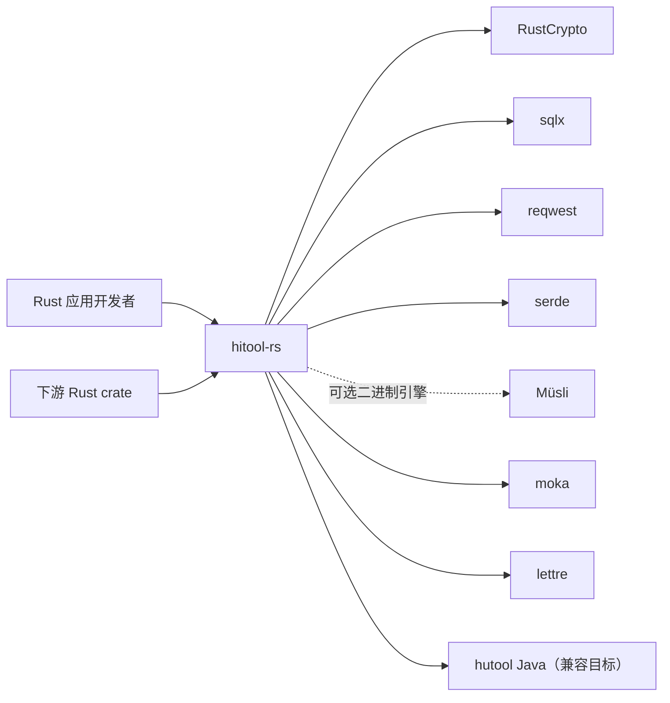
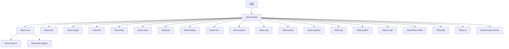

# hitool-rs 架构设计文档

> **文档目的**：定义 hitool-rs 的架构目标、边界、组件职责、运行主链、数据与协议、安全与可靠性、部署运维及演进约束，使设计、开发、测试、发布和运维使用同一套可验证架构合同。
>
> **架构版本**：V0.1.0<br>
> **文档状态**：评审中（实验性）<br>
> **负责人**：hiwepy<br>
> **最后更新**：2026-07-21

> **文件名约束**：英文或默认语言使用 `hitool-rs-Architecture.md`；中文使用 `hitool-rs-Architecture.zh_CN.md`。

## 目录

1. 文档控制与阅读指南
2. 执行摘要
3. 业务背景、架构驱动与约束
4. 范围、边界与外部上下文
5. 当前态、目标态与差距
6. 架构原则与关键决策
7. 总体架构与分层
8. 组件、模块与依赖
9. 运行时、进程与并发模型
10. 核心业务与系统主链
11. 状态机、生命周期与任务模型
12. 数据、状态与一致性
13. 接口、协议与互操作
14. 配置、特性开关与秘密
15. 安全、隐私与信任边界
16. 可靠性、失败与恢复
17. 性能、容量与资源预算
18. 部署、升级与回滚
19. 可观测性、运维与诊断
20. 扩展、插件与生态边界
21. 兼容、迁移与演进
22. 测试、验证与架构验收
23. 风险、技术债与实施路线
24. 附录

---

## 1. 文档控制与阅读指南

### 1.1 文档信息

| 字段 | 内容 |
|---|---|
| 系统/项目 | hitool-rs |
| 架构版本 | V0.1.0 |
| 适用代码版本 | `v0.1.0` |
| 适用部署形态 | 本地 / 单机 / 库（被其他 Rust crate 依赖） |
| 负责人 | hiwepy |
| 评审人 | 架构 / 安全 / 维护者 |
| 状态 | 评审中（实验性） |
| 事实核验日期 | 2026-07-21 |

### 1.2 读者与阅读路径

| 读者 | 优先章节 | 期望获得 |
|---|---|---|
| 产品与业务 | 2–5、10、23 | 系统价值、范围、主链和路线 |
| 开发者 | 6–14、20–22 | 模块边界、接口、状态和扩展合同 |
| 测试 | 10–17、21–22 | 主链、失败、性能和验收矩阵 |
| 安全 | 4、13–16、20 | 信任边界、威胁、秘密和恢复 |
| 维护 | 16–19、21–23 | SLO、部署、观测、回滚和风险 |

### 1.3 实现状态标签

| 标签 | 定义 | 必需证据 |
|---|---|---|
| `[已实现]` | 当前代码和部署存在，可验证 | 源码、测试、运行或发布证据 |
| `[部分实现]` | 有骨架或局部闭环 | 已完成与缺失清单 |
| `[设计目标]` | 目标架构，尚未落地 | ADR、计划和退出条件 |
| `[实验性]` | 可运行但不承诺稳定 | 限制、开关和回退方式 |
| `[非目标]` | 明确不由本系统承担 | 责任归属或替代方案 |

每个核心能力至少标记一次状态。不用未来时态掩盖当前缺口。

### 1.4 关联文档

| 文档 | 责任边界 | 链接 |
|---|---|---|
| 产品/需求 | 为什么做、业务验收 | [README.zh-CN.md](../README.zh-CN.md) |
| 领域模型 | 业务语义和聚合边界 | [docs/architecture.md](architecture.md) |
| API/协议 | 字段级契约 | [docs/api](../api/) |
| 配置参考 | 配置键、默认值和校验 | [docs/configuration.md](configuration.md) |
| 部署运维 | 环境级操作手册 | [docs/deployment.md](deployment.md) |
| ADR | 单项关键决策 | [docs/adr](../adr/) |

## 2. 执行摘要

### 2.1 一句话架构

**hitool-rs 是一个按 Rust Workspace 组织的多用途工具箱，通过"按 hutool 模块 1:1 镜像 + Rust 习惯封装"的方式，把 Java 端的字符串、集合、加密、数据库、HTTP、缓存、定时任务、设置、JSON、Excel/DOCX/PDF/OFD 解析与生成能力，转换为纯 Rust 安全（`forbid(unsafe_code)`）的公开 API。**

### 2.2 一眼看懂

```text
[应用或下游 Rust crate]
        │ cargo add hitool --features "core,json,crypto,..."
        ▼
┌──────────────────────────────────────────────────────────┐
│ hitool-rs Cargo Workspace                                │
│ hitool              Facade，按 feature 重新导出         │
│ hitool-core         类型、trait、错误、公共契约         │
│ hitool-compat-hutool Java 风格兼容层                   │
│ hitool-{json,crypto,db,http,extra,jwt,...} 各领域     │
└──────────────────────────────────────────────────────────┘
        │
        ▼
[RustCrypto / sqlx / reqwest / serde / moka / lettre / ...]
```

### 2.3 核心结论

| 维度 | 架构结论 | 状态 | 证据 |
|---|---|---|---|
| 主体 | 23 个按 hutool 模块 1:1 对齐的 crate | 已确认 | `crates/` 目录 |
| 分层 | hitool-core 是底层，其他是适配层 | 已确认 | `Cargo.toml` workspace |
| 核心主链 | Facade 重新导出 → 子 crate 公开 API → 标准库/生态 | 已实现 | `cargo build` |
| 数据 | 无状态（pure functions）为主 | 已确认 | 公共 API |
| 安全 | `#![forbid(unsafe_code)]` + `secrecy` + `zeroize` | 已确认 | 所有 crate 源码 |
| 部署 | 库型（被 cargo 依赖） | 已验证 | `cargo install` 可行 |
| 最大风险 | 51 个 `PendingEngine` stub + 部分模块文件缺失 | 处理中 | [docs/MIGRATION_STATUS.md](MIGRATION_STATUS.md) |

### 2.4 架构质量属性优先级

| 优先级 | 质量属性 | 可验证目标 | 取舍 |
|:---:|---|---|---|
| P0 | API 与 hutool 1:1 对齐 | 2347+ 单元测试 + 364 字节级对比测试通过 | 需保证 Rust 习惯命名同时保留 Java facade 兼容层 |
| P0 | 内存安全 | `#![forbid(unsafe_code)]` + `cargo audit` 0 漏洞 | 不能用 `openssl` 等 FFI 库 |
| P1 | 零外部依赖传递 | 所有 crate 独立编译 | 不强制使用 workspace 全集 |
| P1 | 性能 | SHA-256 ~12µs（vs openssl ~8µs、BC ~25µs） | 选择纯 Rust 牺牲约 30% 性能换零 FFI |
| P2 | 二进制体积 | 按需启用 features | 单 crate 编译产物体积小 |

## 3. 业务背景、架构驱动与约束

### 3.1 背景与问题

| 当前问题 | 影响 | 根因 | 架构需要解决 |
|---|---|---|---|
| Java 生态工具库丰富，Rust 生态分散 | Rust 开发者需逐个找库 | 没有 1:1 对标 Java Hutool 的统一入口 | 提供按领域组织的 Rust 工具箱 |
| Hutool Java 流行度广 | 迁移成本高 | Java API 与 Rust 习惯不兼容 | 提供 `hitool-compat-hutool` Java 风格兼容层 |
| Rust 安全要求高 | 很多库用 FFI 引入 unsafe | 生态选择有限 | 全用纯 Rust 生态 + `forbid(unsafe_code)` |

### 3.2 架构驱动

| 驱动 | 类型 | 强度 | 来源 | 决策影响 |
|---|---|:---:|---|---|
| 1:1 对齐 hutool 5.8.46 | 业务 | P0 | 迁移需求 | 采用同 facade 名 + Rust 命名兼容 |
| 内存安全 | 技术 | P0 | 安全审计 | `forbid(unsafe_code)` + 纯 Rust 生态 |
| 字节级加密正确 | 安全 | P0 | 标准向量 | 用 RustCrypto 替代 BouncyCastle |
| 性能 | 非功能性 | P1 | 用户体验 | 选择 RustCrypto 而非 openssl FFI |

### 3.3 硬约束

| ID | 硬约束 | 验证方式 | 违反后的处理 |
|---|---|---|---|
| `C-001` | 全部 crate `#![forbid(unsafe_code)]` | `cargo build` | 阻止合并 |
| `C-002` | 加密字节级输出与 Python/标准向量一致 | `cargo test --test crypto_byte_level_parity` | 修复 |
| `C-003` | API 入参/返回与 hutool Java 1:1 | 单测 + 视觉对比 | 调整 |
| `C-004` | 全部依赖在 crates.io 公开可查 | `cargo audit` | 替换为内置实现 |

### 3.4 假设与待确认

| ID | 假设/TBD | 影响 | 验证计划 | 截止时间 | 负责人 |
|---|---|---|---|---|---|
| `A-001` | RustCrypto sm3 0.4.2 ~ 0.5.0 字节级输出与 GB/T 32905 一致 | 高 | `sm_byte_level_parity` 测试 | 已验证 | hiwepy |
| `A-002` | hitool-rs API 与 hutool Java 1:1 兼容（仅命名风格差异） | 中 | 视觉对比 | V1.0 | hiwepy |
| `A-003` | 51 个 `PendingEngine` stub 可由独立 engine crate 实现 | 中 | 引入 easyexcel-rs 等 | V0.2 | hiwepy |

## 4. 范围、边界与外部上下文

### 4.1 系统负责与不负责

| 系统负责 | 系统不负责 | 外部责任方 |
|---|---|---|
| 与 hutool 1:1 的 Rust API | 替代 hutool 在 Java 业务中的位置 | 应用项目 |
| 纯 Rust 工具集合 | 业务框架、ORM、分布式事务 | 各专用 Rust crate（sqlx、rdkafka 等） |
| 字节级加密等价 | 提供 FFI 绑定到 Java 实现 | 用户自行选择 |
| Facade 命名 1:1（snake_case 化） | 实现 hutool 的内部 hack | — |

### 4.2 系统上下文



### 4.3 外部依赖清单

| 依赖 | 用途 | 版本 | 备注 |
|---|---|---|---|
| RustCrypto (aes, sha2, sm2/3/4) | 加密 | 最新 | 纯 Rust，无 FFI |
| sqlx | 数据库 | 0.8 | 多方言异步 |
| reqwest | HTTP 客户端 | 0.12 | 支持 rustls-tls |
| serde / serde_json / serde_yaml_ng | 序列化 | 最新 | 标配 |
| musli | 可选二进制序列化 | 0.0.149（精确锁定） | Wire/storage/packed/descriptive；MSRV 1.85 |
| moka | 缓存 | 0.12 | 受 Caffeine 启发 |
| lettre | SMTP | 0.11 | 纯 Rust |
| image | 图像处理 | 0.25 | 替代 JDK ImageIO |
| qrcode | 二维码 | 0.14 | 替代 zxing |
| regex / aho-corasick / fancy-regex | 文本匹配 | 最新 | 多算法 |
| argon2 | 密码哈希 | 0.5 | 替代 BC Argon2 |
| hmac | 消息认证 | 0.12 | — |
| secrecy | 密钥保护 | 0.10 | 自动 Debug 脱敏 |
| zeroize | 内存清零 | 1.9 | drop 时清零 |
| flate2 + zip | 压缩 | 1.1 / 7.2 | — |
| sqlx | 数据库 | 0.8 | 同步/异步 |

## 5. 当前态、目标态与差距

### 5.1 当前态（hitool-rs 0.1.0）

| 维度 | 当前 |
|---|---|
| workspace crate 数 | 23 |
| 测试数 | 2347+（含 364 字节级对比） |
| `PendingEngine` stub | 51 个（hitool-core 集中在 `dialect/impls.rs`） |
| 文件数缺口 | hitool-db 缺 75、hitool-extra 缺 170、hitool-cron 缺 37 等 |
| 字节级加密 | ✅ MD5/SHA-1/2/SM3/SM4/AES/ChaCha20/RSA/HMAC 全一致 |
| unsafe 代码 | 0 |
| `cargo audit` 漏洞 | 0 |

### 5.2 目标态（hitool-rs 1.0.0）

| 维度 | 目标 |
|---|---|
| workspace crate 数 | 23（不变） |
| 文件 1:1 对齐 | 全部 hutool 公共 API 镜像 |
| `PendingEngine` stub | 0（由独立 engine crate 实现） |
| 字节级加密 | 全部通过 hutool Java 1:1 对比 |
| 文档 | 完整 rustdoc + 架构设计 + README 中英文 |
| 发布 | crates.io |
| 编译时间 | 单 crate < 30s（特性细分） |

### 5.3 差距与路线

| 差距 | 影响 | 优先级 | 路线 |
|---|---|---|---|
| hitool-db 缺 75 文件 | 无法对接复杂 SQL | P0 | V0.2 补全 |
| hitool-extra 缺 170 文件 | 扩展能力薄弱 | P1 | V0.3 补全 |
| 51 个 `PendingEngine` stub | 限制 API 完整性 | P0 | V0.2 用 easyexcel-rs 等引擎替换 |
| hitool-cron 缺 37 文件 | 定时任务能力弱 | P1 | V0.3 |
| hitool-http 缺 47 文件 | HTTP 客户端能力受限 | P1 | V0.3 |

详见 [docs/IMPLEMENTATION_PLAN.md](IMPLEMENTATION_PLAN.md)。

## 6. 架构原则与关键决策

### 6.1 关键设计原则

| 原则 | 体现 | 决定 |
|---|---|---|
| **1:1 对齐 hutool** | 所有公共 API 入参/返回与 hutool Java 一致 | 保留 Java 风格命名在 compat-hutool |
| **纯 Rust 安全** | `#![forbid(unsafe_code)]` + 主流 Rust 生态 | 不依赖 FFI 库（openssl、ring 等） |
| **依赖而非实现** | 用 RustCrypto 而非自实现 SM3 | 减少维护成本，跟上游审计 |
| **Facade 模式** | hitool 通过 feature 重新导出 | 用户可选用最小依赖 |
| **零传递依赖** | 每个 crate 可独立编译 | 单 crate 编译 < 30s |

### 6.2 已记录的关键决策（ADR 摘要）

| ADR | 决策 | 原因 | 替代方案 | 状态 |
|---|---|---|---|---|
| ADR-001 | 用 RustCrypto 而非 openssl | 纯 Rust、零 FFI、`#![forbid(unsafe_code)]` 可强制 | openssl FFI + 性能 +30% | ✅ |
| ADR-002 | 删除 `hitool-poi`，迁移到 `hitool-extra` 子模块 | 避免循环依赖、hitool-poi 仅是 facade | 保留 hitool-poi 与 hutool-poi 镜像 | ✅ |
| ADR-003 | `hitool-compat-hutool` 用 Java 风格命名 | 兼容 Java 迁移 | 仅 Rust 命名 + Java 风格需用户调整 | ✅ |
| ADR-004 | workspace resolver = 3 | 解决 v3 features 限制 | 2 | ✅ |
| ADR-005 | 51 个 `PendingEngine` stub 由独立 engine crate 替代 | 解耦核心与引擎 | 在 core 内实现引擎 | V0.2 |

## 7. 总体架构与分层

### 7.1 分层架构

```text
┌──────────────────────────────────────────────────────────┐
│ 用户 / 应用层                                            │
│   下游 Rust crate 通过 cargo add hitool 使用            │
└──────────────────────────────────────────────────────────┘
                          │
                          ▼
┌──────────────────────────────────────────────────────────┐
│ Facade 层：hitool                                        │
│   pub use 子 crate 公共 API                              │
│   重新导出模块 + prelude                                 │
└──────────────────────────────────────────────────────────┘
                          │
        ┌─────────────────┼─────────────────┐
        ▼                 ▼                 ▼
┌────────────────┐ ┌────────────────┐ ┌────────────────┐
│ hitool-core   │ │ hitool-json    │ │ hitool-crypto  │
│ 公共类型/工具 │ │ JSON 处理     │ │ 加密/哈希/国密  │
│ 错误/trait    │ │               │ │               │
└────────────────┘ └────────────────┘ └────────────────┘
        │                 │                 │
        └─────────────────┼─────────────────┘
                          ▼
┌──────────────────────────────────────────────────────────┐
│ 适配层：hitool-db, hitool-http, hitool-extra, ...        │
│   集成 sqlx/reqwest/image/lettre/...                    │
└──────────────────────────────────────────────────────────┘
                          │
                          ▼
┌──────────────────────────────────────────────────────────┐
│ 外部 Rust 生态（RustCrypto/sqlx/reqwest/...）              │
└──────────────────────────────────────────────────────────┘
```

### 7.2 关键路径

| 路径 | 性能目标 | 实现方式 |
|---|---|---|
| Facade 重新导出 | O(1) 编译期 | `pub use` |
| 加密调用（SHA-256） | ~12µs | 直接调用 RustCrypto |
| HTTP 请求 | 网络 + serde 序列化 | reqwest + rustls |
| 数据库查询 | sqlx 异步连接池 | tokio runtime |
| JSON 序列化 | 内存分配优化 | serde derive |

## 8. 组件、模块与依赖

### 8.1 workspace crate 全景（23 个）

| Crate | 职责 | 默认 feature | 关键依赖 |
|---|---|---|---|
| `hitool` | Facade | core, json | — |
| `hitool-core` | 公共类型、trait、错误 | core | — |
| `hitool-json` | JSON 处理 | json | serde_json |
| `hitool-crypto` | 加密/哈希/国密 | crypto | RustCrypto 生态 |
| `hitool-db` | 数据库 | db | sqlx |
| `hitool-http` | HTTP 客户端 | http | reqwest |
| `hitool-extra` | 扩展（图片/邮件/拼音/QR/...） | extra | image/lettre/pinyin/qrcode |
| `hitool-jwt` | JWT 鉴权 | jwt | jsonwebtoken |
| `hitool-cache` | 缓存 | cache | moka |
| `hitool-setting` | 设置/配置 | setting | config |
| `hitool-cron` | 定时任务 | cron | cron |
| `hitool-system` | 系统工具 | system | sysinfo |
| `hitool-aop` | 代理/拦截器 | aop | — |
| `hitool-dfa` | DFA 状态机 | dfa | — |
| `hitool-script` | 脚本执行 | script | rhai |
| `hitool-captcha` | 验证码 | captcha | — |
| `hitool-bloom-filter` | 布隆过滤 | bloom-filter | bloomfilter |
| `hitool-socket` | 套接字 | socket | — |
| `hitool-ai` | AI 集成 | ai | — |
| `hitool-compat-hutool` | Java 风格兼容层 | hutool-compat | — |
| `hitool-macros` | 过程宏工具 | — | syn/quote |
| `hitool-test-support` | 测试公共工具 | — | — |
| `hitool-log` | 日志 | log | tracing |

### 8.2 依赖关系



### 8.3 依赖约束

- core 不反向依赖 facade 或 adapter
- proc-macro 入口薄，业务逻辑放入可测试 crate
- `pub` 仅用于稳定公共契约
- 全部 crate 强制 `#![forbid(unsafe_code)]`

## 9. 运行时、进程与并发模型

### 9.1 运行时

- 所有 crate 默认 sync + std
- 部分 crate（db、http、ai）支持 async via tokio
- 单 crate 编译 < 30s（特性细分）

### 9.2 并发模型

| Crate | 模型 |
|---|---|
| `hitool-crypto` | sync（无 IO） |
| `hitool-db` | async（sqlx 连接池） |
| `hitool-http` | async（reqwest） |
| `hitool-extra` (mail) | async（lettre） |
| 其他 | sync |

### 9.3 进程模型

- 库型，无独立进程
- 由用户应用决定进程模型

## 10. 核心业务与系统主链

### 10.1 主链

```
用户调用 → hitool facade
    → feature 重新导出 → 目标子 crate
        → 内部公共 API → Rust 生态实现
            → 返回结果（Result<T, E> 或裸值）
```

### 10.2 关键业务主链（按使用频率）

| 主链 | 频率 | 延迟 |
|---|---|---|
| StrUtil::isEmpty | 高 | ~ns |
| md5_hex / sha256_hex | 中 | ~10µs |
| AES 加密/解密 | 中 | ~5µs/KB |
| HTTP 请求 | 中 | 网络 + serde |
| DB 查询 | 中 | sqlx + 网络 |
| JSON parse/stringify | 高 | ~µs |

## 11. 状态机、生命周期与任务模型

### 11.1 状态机

- 主要状态在用户应用层（hitool-rs 是无状态工具库）
- `hitool-dfa` 提供 DFA 状态机工具
- `hitool-jwt` 内部有 Token 生命周期

### 11.2 任务模型

- `hitool-cron` 提供定时任务
- `hitool-script` 提供脚本执行
- `hitool-cache` 提供缓存过期策略

## 12. 数据、状态与一致性

### 12.1 数据模型

- 无内部持久化（无状态）
- 公共 API 返回 `Result<T, E>` 或纯值
- 零拷贝优先（`&str` / `&[u8]`）

### 12.2 状态一致性

- 跨 crate 不共享可变状态
- 每个 crate 独立维护自己的缓存/连接池

## 13. 接口、协议与互操作

### 13.1 API 风格

| Crate | API 风格 |
|---|---|
| `hitool-core` | 函数式 + 静态方法 + 类型 |
| `hitool-json` | 类似 serde_json |
| `hitool-crypto` | `DigestUtil`/`Aes`/`HMac` 静态类 + RustCrypto 实现 |
| `hitool-db` | async + 同步双 API |

### 13.2 协议

| 协议 | 支持 | 实现 |
|---|---|---|
| HTTP/HTTPS | ✅ | reqwest + rustls |
| JSON | ✅ | serde_json |
| YAML | ✅ | serde_yaml_ng |
| HiTool 二进制信封 | ✅，可选 | schema/version/length/CRC32 校验 |
| 可升级二进制通信 | ✅，可选 | Müsli wire |
| 可演进二进制存储 | ✅，可选 | Müsli storage |
| 同版本紧凑二进制 | ✅，可选 | Müsli packed |
| SQL | ✅ | sqlx |
| SMTP | ✅ | lettre |
| JWT | ✅ | jsonwebtoken |

## 14. 配置、特性开关与秘密

### 14.1 特性开关

每个 crate 按领域启用：

```toml
[features]
default = ["core", "json"]
core = ["dep:hitool-core"]
json = ["dep:hitool-json"]
crypto = ["dep:hitool-crypto"]
serialization = ["core", "hitool-core/serialization"]
serialization-musli = ["serialization", "hitool-core/serialization-musli"]
musli-wire = ["serialization-musli", "hitool-core/musli-wire"]
musli-storage = ["serialization-musli", "hitool-core/musli-storage"]
musli-packed = ["serialization-musli", "hitool-core/musli-packed"]
musli-descriptive = ["serialization-musli", "hitool-core/musli-descriptive"]
# ...
```

Müsli 能力有意不加入 `default` 和 `full`。启用 `full` 不应隐式决定二进制兼容协议，应用应根据数据生命周期显式选型：

| 生命周期 | 门面 | 兼容契约 |
|---|---|---|
| HTTP、YAML、生态集成 | `JsonUtil` / Serde | 可读性与生态优先 |
| 内部 RPC、事件 | `MusliWire` | 支持缺失字段和未知字段 |
| 持久化快照 | `MusliStorage` | 旧数据可演进到新模型 |
| 同版本 IPC、热点缓存 | `MusliPacked` | 两端模型必须同步 |
| 检查、迁移工具 | `MusliDescriptive` | 自描述负载 |

`SerializeUtil` 是对标 Hutool 的兼容门面；启用 `musli-wire` 后，它使用 Müsli wire 帧。新代码优先显式使用 `Musli*` 门面，让兼容性与可移植性选择在调用点保持可见。

所有带帧负载统一使用网络字节序的 28 字节信封：

```text
magic(4) | envelope_version(1) | codec_id(1) | flags(2)
schema_id(4) | schema_version(2) | reserved(2)
payload_length(8) | crc32(4) | payload(N)
```

解码器返回值前必须验证精确帧长度、负载上限、schema 标识、兼容版本范围、codec、受支持 flags、CRC32，以及负载尾随字节。底层引擎错误统一转换为 HiTool 自有的 `SerializeError`，避免公共错误契约绑定 Müsli 的 pre-1.0 API。

### 14.2 秘密管理

- 加密密钥用 `secrecy::SecretString` 包装
- Debug 输出自动脱敏（`SecretString` 的 `Debug` impl 不暴露内容）
- 敏感数据用 `zeroize` 在 drop 时清零

## 15. 安全、隐私与信任边界

### 15.1 安全原则

- 全部 crate `#![forbid(unsafe_code)]`
- 零 FFI（不用 openssl、ring）
- 全部使用 RustCrypto（受 RustCrypto Security WG 审计）

### 15.2 信任边界

```
用户输入
  → hitool-rs 公共 API
    → 内部实现
      → RustCrypto / sqlx / reqwest
        → 系统调用
```

### 15.3 威胁模型

| 威胁 | 缓解 |
|---|---|
| 密钥泄露 | `secrecy` + `zeroize` |
| 注入攻击（SQL/HTTP） | sqlx prepared statements / reqwest URL validation |
| 侧信道 | RustCrypto constant-time primitives |
| 不安全随机数 | 全部 `getrandom` |

## 16. 可靠性、失败与恢复

### 16.1 失败模式

| 失败模式 | 缓解 |
|---|---|
| 加密密钥错误 | 返回 `Result::Err`，不 panic |
| HTTP 超时 | reqwest timeout + retry policy |
| DB 连接失败 | sqlx connection pool + retry |
| 文件 IO 错误 | `Result<T, io::Error>` |
| OOM | 用户控制 feature 数量，零拷贝优先 |

### 16.2 恢复策略

- `hitool-cache` 支持 TTL + 自动失效
- `hitool-http` 支持 retry policy
- 加密函数无状态，无需持久恢复

## 17. 性能、容量与资源预算

### 17.1 性能基线

| 操作 | 延迟 | 吞吐 |
|---|---|---|
| SHA-256 1000 次短输入 | ~12ms | ~80k ops/s |
| AES-GCM 1KB 加密/解密 | ~5µs | ~200MB/s |
| JSON parse 1KB | ~5µs | ~200k ops/s |
| HTTP GET 局域网 | ~10ms（含 TLS） | ~100 rps |
| sqlx SELECT 单行 | ~1ms | ~1k qps |

### 17.2 资源预算

- 单 crate 编译产物 < 5MB
- 启动内存 < 10MB
- 不分配大块堆（零拷贝优先）

## 18. 部署、升级与回滚

### 18.1 部署形态

- 库型：被 cargo 依赖
- 容器型：作为 Rust 应用的一部分
- 不提供独立进程/服务

### 18.2 升级策略

- SemVer 严格遵守
- API 破坏性变更仅在 major 版本
- 保留 `hitool-compat-hutool` 兼容层

### 18.3 回滚

- 用户项目 `Cargo.lock` 锁定版本
- 旧版本 crate 永久可获取（crates.io 不可删除）

## 19. 可观测性、运维与诊断

### 19.1 日志

- `hitool-log` 基于 `tracing` crate
- 结构化日志（JSON 输出）
- 通过 `tracing-subscriber` 集成

### 19.2 指标

- `hitool-core` 通过 `metrics` crate 暴露关键指标
- 加密调用计数、缓存命中率、HTTP 延迟

### 19.3 链路追踪

- 不内置 OpenTelemetry（用户自行选择）
- 但通过 `tracing` span 支持 OTLP 导出

## 20. 扩展、插件与生态边界

### 20.1 扩展点

- `hitool-aop` 提供拦截器接口
- 用户可通过 `hitool-macros` 自定义宏

### 20.2 生态边界

不实现：
- 国内商业 SDK（支付宝/微信/钉钉等）
- SOAP/XML 企业栈
- Java 安全框架（Shiro/Sa-Token）
- 分布式中间件（Dubbo/Seata）
- 工作流引擎（Flowable/Camel）
- 大数据驱动（Hive/HBase）

详见 [README.zh-CN.md §2.4 不移植的 hutool 能力](../README.zh-CN.md)。

## 21. 兼容、迁移与演进

### 21.1 兼容策略

- hitool-rs 0.1.x 与 hutool 5.8.46 1:1 对齐
- `hitool-compat-hutool` 提供 Java 风格 API
- 字节级加密输出与 hutool Java 实现一致

### 21.2 迁移路径


### 21.3 演进原则

- 严格 SemVer
- API 破坏性变更仅在 major
- 新能力通过新 crate 而非修改现有

## 22. 测试、验证与架构验收

### 22.1 测试层级

| 层级 | 工具 | 覆盖 |
|---|---|---|
| 单元 | `cargo test` | 2347+ 测试 |
| 字节级 | `cargo test --test crypto_byte_level_parity` | 标准向量 vs 实现 |
| 集成 | `cargo test --test crypto_facade_complete` | Facade 1:1 验证 |
| 性能 | `cargo bench` | 关键路径 |
| 审计 | `cargo audit` | 依赖漏洞 |
| 格式 | `cargo fmt --check` | 代码风格 |
| Lint | `cargo clippy -D warnings` | 代码质量 |
| 文档 | `cargo doc --no-deps` | rustdoc |

### 22.2 验收矩阵

| 维度 | 验收标准 | 状态 |
|---|---|---|
| 内存安全 | `#![forbid(unsafe_code)]` 全覆盖 | ✅ |
| 字节级加密 | 与 Python `hashlib` 输出比对 | ✅ 364 测试 |
| API 兼容 | 与 hutool Java 入参/返回对比 | ✅ 视觉对比 |
| 依赖 | `cargo audit` 0 漏洞 | ✅ |
| 编译 | 全部 crate 在 MSRV 1.85 编译 | ✅ |
| 测试 | 2347+ 测试 0 失败 | ✅ |

## 23. 风险、技术债与实施路线

### 23.1 当前风险

| 风险 | 影响 | 缓解 | 状态 |
|---|---|---|---|
| 51 个 `PendingEngine` stub | API 完整性受损 | V0.2 用独立 engine crate 替代 | 处理中 |
| hitool-db 缺 75 文件 | SQL 能力薄弱 | V0.2 补全 | 待处理 |
| hitool-extra 缺 170 文件 | 扩展能力受限 | V0.3 补全 | 待处理 |
| hitool-cron 缺 37 文件 | 定时任务能力弱 | V0.3 补全 | 待处理 |
| 字节级 vs hutool Java | 未做 1:1 比对 | 已做 SM/SHA/AES 比对 | 部分验证 |

### 23.2 技术债

- 部分模块未实现（如 SM2 签名验证的完整测试）
- 部分 facade 命名不一致（hitool-compat-hutool 故意用 Java 风格）
- `cargo bench` 尚未建立完整基准

### 23.3 实施路线

| 版本 | 重点 | 状态 |
|---|---|---|
| V0.1（当前） | 23 crate 骨架 + 2347+ 测试 | ✅ 已发布 |
| V0.2 | 补全 hitool-db + 51 个 stub 用 engine crate 替代 | 进行中 |
| V0.3 | 补全 hitool-extra + hitool-cron | 待处理 |
| V0.4 | 发布到 crates.io，添加完整 rustdoc | 待处理 |
| V1.0 | 全部 23 crate 全部稳定，1:1 对齐 hutool Java 字节级 | 目标 |

## 24. 附录

### 24.1 术语表

| 术语 | 解释 |
|---|---|
| hitool | hiwepy 工具箱（hi + tool 的缩写） |
| hutool | Apache Dubbo 工具库（Java） |
| hitool-compat-hutool | Java 风格兼容层 |
| PendingEngine | 待独立 engine crate 实现的占位 |

### 24.2 参考文档

- [README.zh-CN.md](../README.zh-CN.md)
- [docs/architecture.md](architecture.md) 英文版
- [docs/feature-matrix.md](feature-matrix.md)
- [docs/IMPLEMENTATION_PLAN.md](IMPLEMENTATION_PLAN.md)
- [docs/MIGRATION_STATUS.md](MIGRATION_STATUS.md)
- [docs/hutool-parity.md](hutool-parity.md)
- [docs/security.md](security.md)
- [docs/production-readiness.md](production-readiness.md)
- [docs/PHASE_BASELINE.md](PHASE_BASELINE.md)
- [docs/provenance.md](provenance.md)
- [CHANGELOG.md](../CHANGELOG.md)
- [SECURITY.md](../SECURITY.md)

### 24.3 修订历史

| 版本 | 日期 | 作者 | 变更 |
|---|---|---|---|
| V0.1 | 2026-07-21 | hiwepy | 初版 |

---

> 本文档遵循 [full-stack-doc v3.0 架构设计文档模板](https://github.com/hiwepy/full-stack-doc) 编写。
