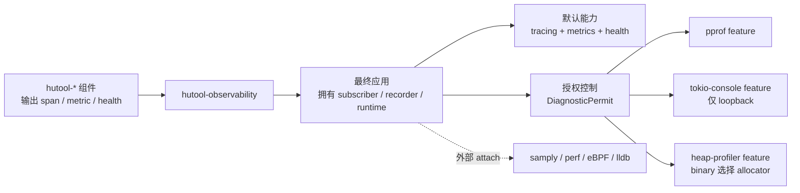

# 可观测性与性能诊断

`hutool-observability` 是 Hutool-Rust 的独立可观测性组件。它遵循以下
固定边界：

- tracing、metrics、health 是 crate 的默认 feature；
- pprof、tokio-console、heap-profiler 必须显式编译；
- 三个诊断后端即使已经编译，也必须取得运行时 `DiagnosticPermit`；
- samply、perf、eBPF、bpftrace、gdb 和 lldb 永远是外部工具，不进入依赖树；
- crate 不启动 HTTP 管理服务，不创建隐藏 Tokio runtime，不选择全局 allocator。



## Feature 契约

| Feature | 默认 | 是否需要运行时授权 | 边界 |
|---|:---:|:---:|---|
| `tracing` | 是 | 否 | 提供 reloadable filter；只有显式调用 `install` 才安装全局 subscriber |
| `metrics` | 是 | 否 | 显式安装 Prometheus recorder；只返回渲染 handle，不启动 scrape server |
| `health` | 是 | 否 | 应用拥有的线程安全健康注册表 |
| `pprof` | 否 | 是 | 启动采样和读取 protobuf 都要求 `CpuProfile` permit |
| `tokio-console` | 否 | 是 | 只接受 loopback 地址；应用自行运行 console server |
| `heap-profiler` | 否 | 是 | 应用必须显式声明 `DhatAllocator` 为全局 allocator |

`hutool` facade 的 `full` 只包含默认的 `observability`，不会隐式启用三个
诊断 feature。

## 默认接入

```rust
use hutool_observability::{
    HealthRegistry, HealthStatus,
    metrics::{PrometheusMetrics, counter},
    tracing::{TracingConfig, install},
};

let _reload = install(&TracingConfig::default())?;
let prometheus = PrometheusMetrics::install()?;
let health = HealthRegistry::new("orders")?;

health.set("database", HealthStatus::Healthy, None)?;
counter!("orders_started_total").increment(1);

// 由应用自己的、经过认证的管理路由返回：
let metrics_body = prometheus.render();
let health_report = health.report()?;
```

全局 subscriber 和 metrics recorder 都只能安装一次。库代码只应输出
span/metric，不应调用上述 `install`。

## 诊断授权

默认 `DiagnosticsAccess` 拒绝所有诊断操作。共享令牌至少为 16 字节，
以常量时间比较，并在 Debug 输出中脱敏：

```rust
use hutool_observability::{
    DiagnosticAction, DiagnosticsAccess, StaticTokenAuthorizer,
};

let access = DiagnosticsAccess::new(
    StaticTokenAuthorizer::new(secret_token.as_bytes().to_vec())?
);
let permit = access.authorize(DiagnosticAction::CpuProfile, presented_token)?;
```

生产应用应从自己的认证管理面提取 credential。不得把 token 放在 URL
query、日志、span 或健康详情中。

## CPU profiling

```toml
hutool-observability = { version = "0.1", features = ["pprof"] }
```

```rust
let session = CpuProfileSession::start(&CpuProfileConfig::default(), &permit)?;
// 采样窗口由应用设置上限。
let protobuf = session.protobuf(&permit)?;
```

应用负责限制采集时长、并发次数、响应大小和管理端点访问。推荐使用专用
profiling 构建：

```bash
RUSTFLAGS="-C force-frame-pointers=yes" \
  cargo build --profile profiling --features observability-pprof
```

内置 pprof 采样后端仅在 Unix 目标启用；非 Unix 目标保留相同 API，并返回
明确的 `UnsupportedPlatform` 错误。

## Tokio Console

```bash
RUSTFLAGS="--cfg tokio_unstable" \
  cargo build --features observability-tokio-console
```

`tokio_console_parts` 返回 `ConsoleLayer` 和 `Server`。应用把 Layer 组合进
自己的 subscriber，并在已有 Tokio runtime 上运行 Server。组件拒绝
`0.0.0.0`、公网 IP 等非 loopback 地址；远程诊断必须通过经过认证的隧道
或管理代理。

## Heap profiling

```rust
#[cfg(feature = "observability-heap-profiler")]
#[global_allocator]
static ALLOC: hutool::observability::DhatAllocator =
    hutool::observability::DhatAllocator;
```

随后在 `main` 最前面取得 `HeapProfile` permit 并启动
`HeapProfileSession`。只有最终 binary 可以选择全局 allocator；任何
`hutool-*` 库都不得替应用做此决定。DHAT 会显著降低性能，只用于专用诊断
构建。

## 外部工具链

下列工具不会成为 Cargo 依赖或 facade feature：

| 工具 | 用途 |
|---|---|
| samply / perf | 本地或宿主机 CPU 采样 |
| eBPF / bpftrace | 无侵入 uprobe、系统调用和延迟分布 |
| lldb / gdb | 崩溃、死锁和底层状态 |

它们统一使用 `profiling` profile；部署系统负责保存匹配二进制的符号和
构建 ID。
