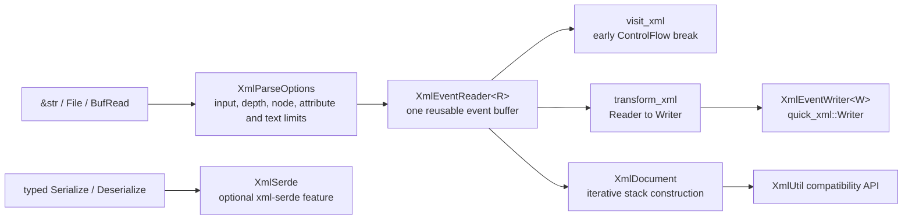

# XML parsing and streaming

`hutool-core` uses `quick-xml 0.41.0` for its XML implementation. The crate
does not claim a general performance multiplier: throughput and allocation
results depend on the document shape, input source, enabled features and target
machine.

## Architecture



The API has three deliberate layers:

| Layer | API | Memory model | Use case |
|---|---|---|---|
| Streaming | `XmlEventReader`, `visit_xml`, `transform_xml`, `XmlEventWriter` | one reusable event buffer, except data retained by the caller | large files, filtering and early lookup |
| DOM compatibility | `XmlUtil`, `XmlDocument`, `XmlNode` | O(document size) | Hutool-compatible traversal and random access |
| Direct Serde | `XmlSerde` | controlled by `quick-xml` and the target type | typed request and response payloads |

`XmlUtil::read_xml` parses through `File` and `BufReader`; it no longer reads
the complete file into a `String` first. DOM construction is iterative, so it
does not allocate a new parser buffer at every nesting level. The resulting DOM
still retains the full document by design.

## Safe defaults

`XmlParseOptions::default()` applies:

| Policy | Default |
|---|---:|
| maximum input | 16 MiB |
| maximum depth | 128 |
| maximum elements | 100,000 |
| maximum attributes per element | 256 |
| maximum cumulative decoded text and CDATA | 8 MiB |
| namespace handling | preserve qualified names |
| DOCTYPE | reject |
| unknown named general references | reject |
| invalid-character sanitization | disabled |

Numeric references and the five predefined XML references remain supported.
Allowing unknown named references never enables DTD entity expansion.
Attribute decoding, malformed XML and writer failures return typed
`CoreError` values; they are not flattened or converted into empty strings.

Sanitization is intentionally explicit because it changes input:

```rust
use hutool_core::{XmlParseOptions, XmlUtil};

let options = XmlParseOptions {
    sanitize_invalid_chars: true,
    ..XmlParseOptions::default()
};
let document = XmlUtil::parse_xml_with_options("<root>a\u{1}b</root>", &options)?;
# Ok::<(), hutool_core::CoreError>(())
```

## Streaming examples

Stop after the first matching element without reading the remaining input:

```rust
use std::{io::Cursor, ops::ControlFlow};
use hutool_core::{XmlParseOptions, visit_xml};
use quick_xml::events::Event;

let mut found = false;
visit_xml(
    Cursor::new(b"<root><item /></root>"),
    XmlParseOptions::default(),
    |event| {
        if matches!(event, Event::Empty(element) if element.name().as_ref() == b"item") {
            found = true;
            return Ok(ControlFlow::Break(()));
        }
        Ok(ControlFlow::Continue(()))
    },
)?;
assert!(found);
# Ok::<(), hutool_core::CoreError>(())
```

`transform_xml` validates the same limits while copying retained events through
`quick_xml::Writer`. Use it when a transform can be expressed as event
filtering. Build a DOM only when the operation genuinely needs random access or
tree mutation.

## Optional features

The basic DOM and streaming APIs are always part of `hutool-core`. Additional
integration is opt-in:

```toml
hutool-core = { version = "0.1", features = ["xml-serde"] }
```

| Feature | Enables | Default |
|---|---|---|
| `xml-serde` | direct `XmlSerde::{from_str, from_reader, to_string, to_writer}` | off |
| `xml-encoding` | non-UTF-8 decoding support from `quick-xml` | off |
| `xml-async` | the upstream Tokio async adapter and the crate async runtime support | off |

The legacy `XmlUtil::bean_to_xml` and `XmlUtil::xml_to_bean` APIs retain their
Hutool-compatible JSON-value mapping. New typed integrations should prefer
`XmlSerde`, which does not use a `serde_json::Value` intermediate.

## Verification boundary

The focused regression suite covers:

- the 43 existing `XmlUtil` compatibility cases;
- input, depth, node, attribute and text limits;
- namespace preservation and explicit local-name mode;
- DTD, entity, malformed-attribute and invalid-character behavior;
- visitor early termination, streaming transform and writer escaping;
- optional direct Serde string, reader and writer round trips.

These tests verify behavior, not a performance claim. Before publishing
throughput or memory numbers, benchmark small configuration files, large logs,
deep SOAP documents, wide-node documents and representative OOXML parts on a
declared machine. Record throughput, allocations and peak resident memory, and
compare streaming and DOM paths separately.
